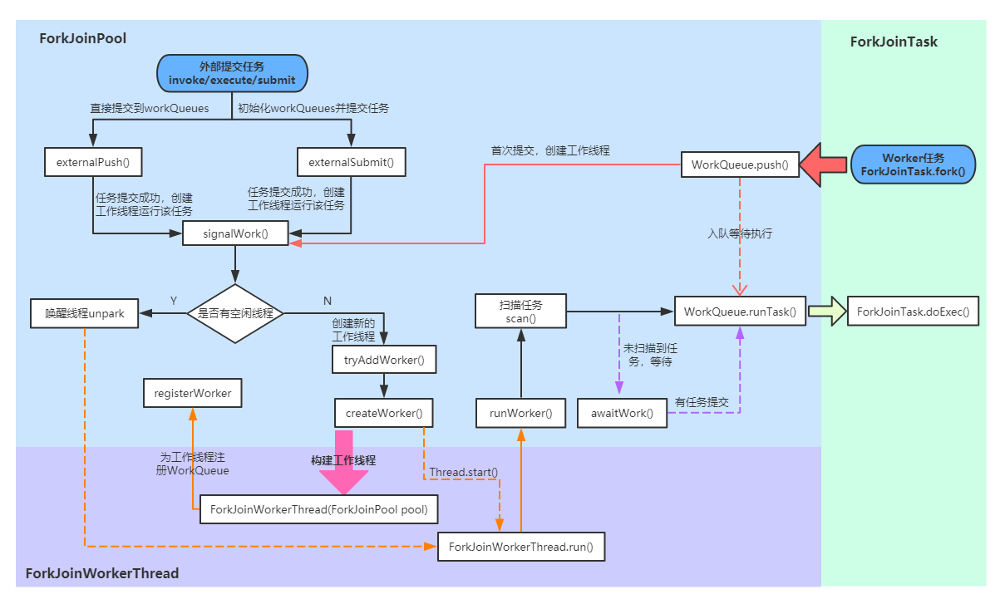

# ForkJoinPool 源码详解
## 概述

---

## 源码分析
### 构造方法
最终调用的构造方法如下：
```java
    private ForkJoinPool(int parallelism,
                         ForkJoinWorkerThreadFactory factory,
                         UncaughtExceptionHandler handler,
                         int mode,
                         String workerNamePrefix) {
        this.workerNamePrefix = workerNamePrefix;
        this.factory = factory;
        this.ueh = handler;
        this.config = (parallelism & SMASK) | mode;
        long np = (long)(-parallelism); // offset ctl counts
        this.ctl = ((np << AC_SHIFT) & AC_MASK) | ((np << TC_SHIFT) & TC_MASK);
    }
```
- parallelism：并行度，默认为CPU数，最小为1
- factory：工作线程工厂
- handler：处理工作线程运行任务时的异常情况类，默认为null
- mode：默认为0，遵循LIFO。如果为1，表示子任务的执行遵循 FIFO 顺序并且任务不能被合并（join），这种模式适用于工作线程只运行事件类型的异步任务。

---
### 外部任务提交
ForkJoinPool 中的任务执行分两种：
1. 直接通过 ForkJoinPool 提交的外部任务（external/submissions task），存放在 workQueues 的偶数槽位
2. 通过内部 fork 分割的子任务（Worker task），存放在 workQueues 的奇数槽位
3. 下面是 Fork/Join 调用过程：

#### 外部任务提交
> 向 ForkJoinPool 提交任务有三种方式：invoke()会等待任务计算完毕并返回计算结果；execute()是直接向池提交一个任务来异步执行，无返回结果；submit()也是异步执行，但是会返回提交的任务，在适当的时候可通过task.get()获取执行结果。
这三种提交方式都都是调用externalPush()方法来完成，所以接下来我们将从externalPush()方法开始逐步分析外部任务的执行过程。
##### externalPush(ForkJoinTask<?> task) 方法
> 这个方法前面的三种任务提交方式都会调用

```java
//添加给定任务到submission队列中
final void externalPush(ForkJoinTask<?> task) {
    WorkQueue[] ws;
    WorkQueue q;
    int m;
    int r = ThreadLocalRandom.getProbe();//探针值，用于计算WorkQueue槽位索引
    int rs = runState;
    if ((ws = workQueues) != null && (m = (ws.length - 1)) >= 0 &&
            (q = ws[m & r & SQMASK]) != null && r != 0 && rs > 0 && //获取随机偶数槽位的workQueue
            U.compareAndSwapInt(q, QLOCK, 0, 1)) {//锁定workQueue
        ForkJoinTask<?>[] a;
        int am, n, s;
        if ((a = q.array) != null &&
                (am = a.length - 1) > (n = (s = q.top) - q.base)) {
            int j = ((am & s) << ASHIFT) + ABASE;//计算任务索引位置
            U.putOrderedObject(a, j, task);//任务入列
            U.putOrderedInt(q, QTOP, s + 1);//更新push slot
            U.putIntVolatile(q, QLOCK, 0);//解除锁定
            if (n <= 1)
                signalWork(ws, q);//任务数小于1时尝试创建或激活一个工作线程
            return;
        }
        U.compareAndSwapInt(q, QLOCK, 1, 0);//解除锁定
    }
    externalSubmit(task);//初始化workQueues及相关属性
}
```
- externalPush和externalSubmit两个方法的联系：
> 它们的作用都是把任务放到队列中等待执行。不同的是，externalSubmit可以说是完整版的externalPush，在任务首次提交时，需要初始化workQueues及其他相关属性，这个初始化操作就是externalSubmit来完成的；而后再向池中提交的任务都是通过简化版的externalSubmit-externalPush来完成。
>
> externalPush的执行流程很简单：首先找到一个随机偶数槽位的 workQueue，然后把任务放入这个 workQueue 的任务数组中，并更新top位。如果队列的剩余任务数小于1，则尝试创建或激活一个工作线程来运行任务（防止在externalSubmit初始化时发生异常导致工作线程创建失败）。

---

##### externalSubmit(ForkJoinTask<?> task) 方法

```java
//任务提交
private void externalSubmit(ForkJoinTask<?> task) {
    //初始化调用线程的探针值，用于计算WorkQueue索引
    int r;                                    // initialize caller's probe
    if ((r = ThreadLocalRandom.getProbe()) == 0) {
        ThreadLocalRandom.localInit();
        r = ThreadLocalRandom.getProbe();
    }
    for (; ; ) {
        WorkQueue[] ws;
        WorkQueue q;
        int rs, m, k;
        boolean move = false;
        if ((rs = runState) < 0) {// 池已关闭
            tryTerminate(false, false);     // help terminate
            throw new RejectedExecutionException();
        }
        //初始化workQueues
        else if ((rs & STARTED) == 0 ||     // initialize
                ((ws = workQueues) == null || (m = ws.length - 1) < 0)) {
            int ns = 0;
            rs = lockRunState();//锁定runState
            try {
                //初始化
                if ((rs & STARTED) == 0) {
                    //初始化stealCounter
                    U.compareAndSwapObject(this, STEALCOUNTER, null,
                            new AtomicLong());
                    //创建workQueues，容量为2的幂次方
                    // create workQueues array with size a power of two
                    int p = config & SMASK; // ensure at least 2 slots
                    int n = (p > 1) ? p - 1 : 1;
                    n |= n >>> 1;
                    n |= n >>> 2;
                    n |= n >>> 4;
                    n |= n >>> 8;
                    n |= n >>> 16;
                    n = (n + 1) << 1;
                    workQueues = new WorkQueue[n];
                    ns = STARTED;
                }
            } finally {
                unlockRunState(rs, (rs & ~RSLOCK) | ns);//解锁并更新 runState 为 STARTED
            }
        } else if ((q = ws[k = r & m & SQMASK]) != null) {//获取随机偶数槽位的workQueue
        //若 q 获取到的 workQueue 为空，则执行下面的 create new queue
            if (q.qlock == 0 && U.compareAndSwapInt(q, QLOCK, 0, 1)) {//锁定 workQueue
                ForkJoinTask<?>[] a = q.array;//当前workQueue的全部任务
                int s = q.top;
                boolean submitted = false; // initial submission or resizing
                try {                      // locked version of push
                    if ((a != null && a.length > s + 1 - q.base) ||
                            (a = q.growArray()) != null) {//扩容
                        int j = (((a.length - 1) & s) << ASHIFT) + ABASE;
                        U.putOrderedObject(a, j, task);//放入给定任务
                        U.putOrderedInt(q, QTOP, s + 1);//修改push slot
                        submitted = true;
                    }
                } finally {
                    U.compareAndSwapInt(q, QLOCK, 1, 0);//解除锁定
                }
                if (submitted) {//任务提交成功，创建或激活工作线程
                    signalWork(ws, q);//创建或激活一个工作线程来运行任务
                    return;
                }
            }
            move = true;                   // move on failure 操作失败，重新获取探针值
        } else if (((rs = runState) & RSLOCK) == 0) { // create new queue
            q = new WorkQueue(this, null);
            q.hint = r;
            q.config = k | SHARED_QUEUE;
            q.scanState = INACTIVE;
            rs = lockRunState();           // publish index
            if (rs > 0 && (ws = workQueues) != null &&
                    k < ws.length && ws[k] == null)
                ws[k] = q;                 // 更新索引k位值的workQueue
                // 这里 k 的值在 else if ((q = ws[k = r & m & SQMASK]) != null) 处已经赋值
            //else terminated
            unlockRunState(rs, rs & ~RSLOCK);
        } else
            move = true;                   // move if busy
        if (move)
            r = ThreadLocalRandom.advanceProbe(r);//重新获取线程探针值
    }
```
> externalSubmit是externalPush的完整版本，主要用于第一次提交任务时初始化workQueues及相关属性，并且提交给定任务到队列中。具体执行步骤如下：
1. 如果池为终止状态(**runState<0**)，调用**tryTerminate**来终止线程池，并抛出任务拒绝异常
2. 如果尚未初始化，就为 **ForkJoinPool** 执行初始化操作：初始化**stealCounter**、创建**workerQueues**，然后继续自旋
3. 初始化完成后，执行在externalPush中相同的操作：获取 **workQueue**，放入指定任务。任务提交成功后调用**signalWork**方法创建或激活线程
4. 如果在步骤3中获取到的 workQueue 为**null**，会在这一步中创建一个 **workQueue**，创建成功继续自旋执行第三步操作
5. 如果非上述情况，或者有线程争用资源导致获取锁失败，就重新获取线程探针值继续自旋

---
#### 内外任务提交公用方法
##### signalWork(WorkQueue[] ws, WorkQueue q) 方法
> 新建或唤醒一个工作线程，在**externalPush、externalSubmit、workQueue.push、workQueue.scan**中调用。如果还有空闲线程，则尝试唤醒索引到的 **WorkQueue** 的 **parker线程**；如果工作线程过少（**(ctl & ADD_WORKER) != 0L**），则调用**tryAddWorker**添加一个新的工作线程。
```java
final void signalWork(WorkQueue[] ws, WorkQueue q) {
    long c;
    int sp, i;
    WorkQueue v;
    Thread p;
    while ((c = ctl) < 0L) {                       // too few active
        if ((sp = (int) c) == 0) {                  // no idle workers
            if ((c & ADD_WORKER) != 0L)            // too few workers
                tryAddWorker(c);//工作线程太少，添加新的工作线程
            break;
        }
        if (ws == null)                            // unstarted/terminated
            break;
        if (ws.length <= (i = sp & SMASK))         // terminated
            break;
        if ((v = ws[i]) == null)                   // terminating
            break;
        //计算ctl，加上版本戳SS_SEQ避免ABA问题
        int vs = (sp + SS_SEQ) & ~INACTIVE;        // next scanState
        int d = sp - v.scanState;                  // screen CAS
        //计算活跃线程数（高32位）并更新为下一个栈顶的scanState（低32位）
        long nc = (UC_MASK & (c + AC_UNIT)) | (SP_MASK & v.stackPred);
        if (d == 0 && U.compareAndSwapLong(this, CTL, c, nc)) {
            v.scanState = vs;                      // activate v
            if ((p = v.parker) != null)
                U.unpark(p);//唤醒阻塞线程
            break;
        }
        if (q != null && q.base == q.top)          // no more work
            break;
    }
}
```

---
##### tryAddWorker(long c) 方法
> 尝试添加一个新的工作线程，首先更新**ctl**中的工作线程数，然后调用`createWorker()`创建工作线程。

```java
private void tryAddWorker(long c) {
    boolean add = false;
    do {
        long nc = ((AC_MASK & (c + AC_UNIT)) |
                   (TC_MASK & (c + TC_UNIT)));
        if (ctl == c) {
            int rs, stop;                 // check if terminating
            if ((stop = (rs = lockRunState()) & STOP) == 0)
                add = U.compareAndSwapLong(this, CTL, c, nc);
            unlockRunState(rs, rs & ~RSLOCK);//释放锁
            if (stop != 0)
                break;
            if (add) {
                createWorker();//创建工作线程
                break;
            }
        }
    } while (((c = ctl) & ADD_WORKER) != 0L && (int)c == 0);
}
```

---
##### createWorker() 方法
> **createWorker**首先通过线程工厂创一个新的**ForkJoinWorkerThread**，然后启动这个工作线程`（wt.start()）`。如果期间发生异常，调用**deregisterWorker**处理线程创建失败的逻辑。

```java
private boolean createWorker() {
    ForkJoinWorkerThreadFactory fac = factory;
    Throwable ex = null;
    ForkJoinWorkerThread wt = null;
    try {
        if (fac != null && (wt = fac.newThread(this)) != null) {
            wt.start();
            return true;
        }
    } catch (Throwable rex) {
        ex = rex;
    }
    deregisterWorker(wt, ex);//线程创建失败处理
    return false;
}
```
这里可以看一下 ForkJoinWorkerThread 的构造方法：

```java
protected ForkJoinWorkerThread(ForkJoinPool pool) {
    // Use a placeholder until a useful name can be set in registerWorker
    super("aForkJoinWorkerThread");
    this.pool = pool;
    this.workQueue = pool.registerWorker(this);
}
```
> 可以看到 **ForkJoinWorkerThread** 在构造时首先调用父类 **Thread** 的方法，然后为工作线程注册 **pool** 和 **workQueue** ，而**workQueue**的注册任务由 **ForkJoinPool.registerWorker** 来完成。
---
##### registerWorker(ForkJoinWorkerThread wt) 方法

```java
final WorkQueue registerWorker(ForkJoinWorkerThread wt) {
    UncaughtExceptionHandler handler;
    //设置为守护线程
    wt.setDaemon(true);                           // configure thread
    if ((handler = ueh) != null)
        wt.setUncaughtExceptionHandler(handler);
    WorkQueue w = new WorkQueue(this, wt);//构造新的WorkQueue
    int i = 0;                                    // assign a pool index
    int mode = config & MODE_MASK;
    int rs = lockRunState();
    try {
        WorkQueue[] ws;
        int n;                    // skip if no array
        if ((ws = workQueues) != null && (n = ws.length) > 0) {
            //生成新建WorkQueue的索引
            int s = indexSeed += SEED_INCREMENT;  // unlikely to collide
            int m = n - 1;
            i = ((s << 1) | 1) & m;               // Worker任务放在奇数索引位 odd-numbered indices
                                                  // i = ((s << 1) | 1) & m 生成随机奇数
            if (ws[i] != null) {                  // collision 已存在，重新计算索引位
                int probes = 0;                   // step by approx half n
                int step = (n <= 4) ? 2 : ((n >>> 1) & EVENMASK) + 2;
                //查找可用的索引位
                while (ws[i = (i + step) & m] != null) {
                    if (++probes >= n) {//所有索引位都被占用，对workQueues进行扩容
                        workQueues = ws = Arrays.copyOf(ws, n <<= 1);//workQueues 扩容
                        m = n - 1;
                        probes = 0;
                    }
                }
            }
            w.hint = s;                           // use as random seed
            w.config = i | mode;
            w.scanState = i;                      // publication fence
            ws[i] = w;
        }
    } finally {
        unlockRunState(rs, rs & ~RSLOCK);
    }
    wt.setName(workerNamePrefix.concat(Integer.toString(i >>> 1)));
    return w;
}
```
> 在此为工作线程创建的 WorkQueue 是放在奇数索引的，是因为外部任务提交都是通过 main 线程来执行的

---
### 子任务（Worker task）提交
> 子任务的提交相对比较简单，由任务的fork()方法完成。通过上面的流程图可以看到任务被分割（fork）之后调用了ForkJoinPool.WorkQueue.push()方法直接把任务放到队列中等待被执行。
##### ForkJoinTask.fork() 方法
> 如果当前线程是 Worker 线程，说明当前任务是fork分割的子任务，通过 `ForkJoinPool.workQueue.push()` 方法直接把任务放到自己的等待队列中；否则调用 `ForkJoinPool.externalPush()` 提交到一个随机的等待队列中（外部任务）。

```java
public final ForkJoinTask<V> fork() {
    Thread t;
    if ((t = Thread.currentThread()) instanceof ForkJoinWorkerThread)
        ((ForkJoinWorkerThread)t).workQueue.push(this);
    else
        ForkJoinPool.common.externalPush(this);
    return this;
}
```

---
##### ForkJoinPool.WorkQueue.push() 方法

```java
final void push(ForkJoinTask<?> task) {
    ForkJoinTask<?>[] a;
    ForkJoinPool p;
    int b = base, s = top, n;
    if ((a = array) != null) {    // ignore if queue removed
        int m = a.length - 1;     // fenced write for task visibility
        U.putOrderedObject(a, ((m & s) << ASHIFT) + ABASE, task);
        U.putOrderedInt(this, QTOP, s + 1);
        if ((n = s - b) <= 1) {//首次提交，创建或唤醒一个工作线程
            if ((p = pool) != null)
                p.signalWork(p.workQueues, this);
        } else if (n >= m)
            growArray();
    }
}
```
> 首先把任务放入等待队列并更新**top**位；如果当前 WorkQueue 为新建的等待队列 `（top-base<=1）` ，则调用**signalWork**方法为当前 WorkQueue 新建或唤醒一个工作线程；如果 WorkQueue 中的任务数组容量过小，则调用 `growArray()` 方法对其进行两倍扩容， `growArray()` 方法源码如下：
```java
final ForkJoinTask<?>[] growArray() {
    ForkJoinTask<?>[] oldA = array;//获取内部任务列表
    int size = oldA != null ? oldA.length << 1 : INITIAL_QUEUE_CAPACITY;
    if (size > MAXIMUM_QUEUE_CAPACITY)
        throw new RejectedExecutionException("Queue capacity exceeded");
    int oldMask, t, b;
    //新建一个两倍容量的任务数组
    ForkJoinTask<?>[] a = array = new ForkJoinTask<?>[size];
    if (oldA != null && (oldMask = oldA.length - 1) >= 0 &&
            (t = top) - (b = base) > 0) {
        int mask = size - 1;
        //从老数组中拿出数据，放到新的数组中
        do { // emulate poll from old array, push to new array
            ForkJoinTask<?> x;
            int oldj = ((b & oldMask) << ASHIFT) + ABASE;
            int j = ((b & mask) << ASHIFT) + ABASE;
            x = (ForkJoinTask<?>) U.getObjectVolatile(oldA, oldj);
            if (x != null &&
                    U.compareAndSwapObject(oldA, oldj, x, null))
                U.putObjectVolatile(a, j, x);
        } while (++b != t);
    }
    return a;
}
```

---
### 任务执行
> 回到我们开始时的流程图，在 `ForkJoinPool .createWorker()` 方法中创建工作线程后，会启动工作线程，系统为工作线程分配到CPU执行时间片之后会执行  ForkJoinWorkerThread 的 `run()` 方法正式开始执行任务。
##### ForkJoinWorkerThread.run() 方法
```java
public void run() {
    if (workQueue.array == null) { // only run once
        Throwable exception = null;
        try {
            onStart();//钩子方法，可自定义扩展
            pool.runWorker(workQueue);
        } catch (Throwable ex) {
            exception = ex;
        } finally {
            try {
                onTermination(exception);//钩子方法，可自定义扩展
            } catch (Throwable ex) {
                if (exception == null)
                    exception = ex;
            } finally {
                pool.deregisterWorker(this, exception);//处理异常
            }
        }
    }
}
```
>在工作线程运行前后会调用自定义钩子函数（**onStart**和**onTermination**），任务的运行则是调用了`ForkJoinPool.runWorker()`。如果全部任务执行完毕或者期间遭遇异常，则通过`ForkJoinPool.deregisterWorker`关闭工作线程并处理异常信息

---
#####  ForkJoinPool.runWorker(WorkQueue w) 方法

```java
final void runWorker(WorkQueue w) {
    w.growArray();                   // allocate queue
    int seed = w.hint;               // initially holds randomization hint
    int r = (seed == 0) ? 1 : seed;  // avoid 0 for xorShift
    for (ForkJoinTask<?> t; ; ) {
        if ((t = scan(w, r)) != null)//扫描任务执行
            w.runTask(t);
        else if (!awaitWork(w, r))
            break;
        r ^= r << 13;
        r ^= r >>> 17;
        r ^= r << 5; // xorshift
    }
}
```
>**runWorker**是 **ForkJoinWorkerThread** 的主运行方法，用来依次执行当前工作线程中的任务。函数流程很简单：调用**scan**方法依次获取任务，然后调用`WorkQueue .runTask`运行任务；如果未扫描到任务，则调用**awaitWork**等待，直到工作线程/线程池终止或等待超时。

---
##### ForkJoinPool.scan(WorkQueue w, int r) 方法

```java
private ForkJoinTask<?> scan(WorkQueue w, int r) {
    WorkQueue[] ws;
    int m;
    if ((ws = workQueues) != null && (m = ws.length - 1) > 0 && w != null) {
        int ss = w.scanState;                     // initially non-negative
        //初始扫描起点，自旋扫描
        for (int origin = r & m, k = origin, oldSum = 0, checkSum = 0; ; ) {
            WorkQueue q;
            ForkJoinTask<?>[] a;
            ForkJoinTask<?> t;
            int b, n;
            long c;
            if ((q = ws[k]) != null) {//获取workQueue
                if ((n = (b = q.base) - q.top) < 0 &&
                        (a = q.array) != null) {      // non-empty
                    //计算偏移量
                    long i = (((a.length - 1) & b) << ASHIFT) + ABASE;
                    if ((t = ((ForkJoinTask<?>)
                            U.getObjectVolatile(a, i))) != null && //取base位置任务
                            q.base == b) {//stable
                        if (ss >= 0) {  //scanning
                            if (U.compareAndSwapObject(a, i, t, null)) {//
                                q.base = b + 1;//更新base位
                                if (n < -1)       // signal others
                                    signalWork(ws, q);//创建或唤醒工作线程来运行任务
                                return t;
                            }
                        } else if (oldSum == 0 &&   // try to activate 尝试激活工作线程
                                w.scanState < 0)
                            tryRelease(c = ctl, ws[m & (int) c], AC_UNIT);//唤醒栈顶工作线程
                    }
                    //base位置任务为空或base位置偏移，随机移位重新扫描
                    if (ss < 0)                   // refresh
                        ss = w.scanState;
                    r ^= r << 1;
                    r ^= r >>> 3;
                    r ^= r << 10;
                    origin = k = r & m;           // move and rescan
                    oldSum = checkSum = 0;
                    continue;
                }
                checkSum += b;//队列任务为空，记录base位
            }
            //更新索引k 继续向后查找
            if ((k = (k + 1) & m) == origin) {    // continue until stable
                //运行到这里说明已经扫描了全部的 workQueues，但并未扫描到任务

                if ((ss >= 0 || (ss == (ss = w.scanState))) &&
                        oldSum == (oldSum = checkSum)) {
                    if (ss < 0 || w.qlock < 0)    // already inactive
                        break;// 已经被灭活或终止,跳出循环

                    //对当前WorkQueue进行灭活操作
                    int ns = ss | INACTIVE;       // try to inactivate
                    long nc = ((SP_MASK & ns) |
                            (UC_MASK & ((c = ctl) - AC_UNIT)));//计算ctl为INACTIVE状态并减少活跃线程数
                    w.stackPred = (int) c;         // hold prev stack top
                    U.putInt(w, QSCANSTATE, ns);//修改scanState为inactive状态
                    if (U.compareAndSwapLong(this, CTL, c, nc))//更新scanState为灭活状态
                        ss = ns;
                    else
                        w.scanState = ss;         // back out
                }
                checkSum = 0;//重置checkSum，继续循环
            }
        }
    }
    return null;
}
```


