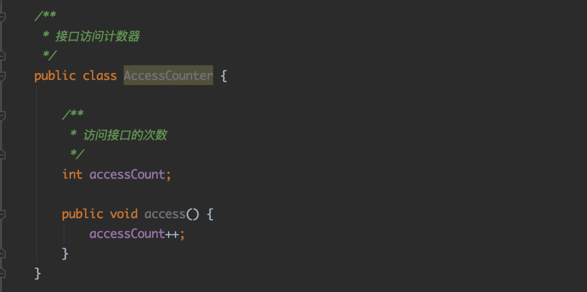
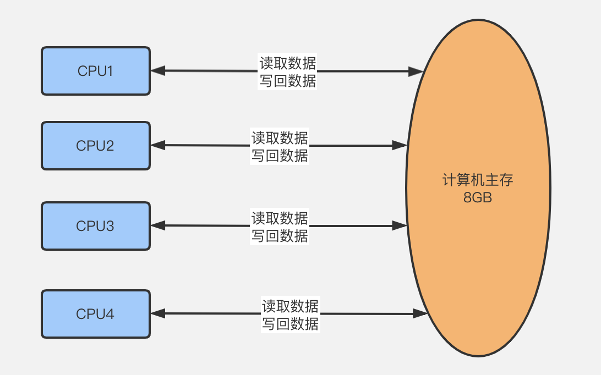
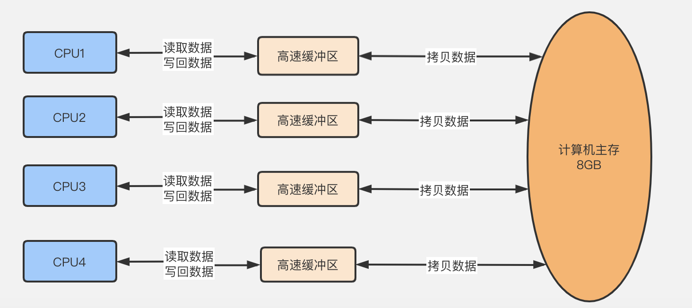
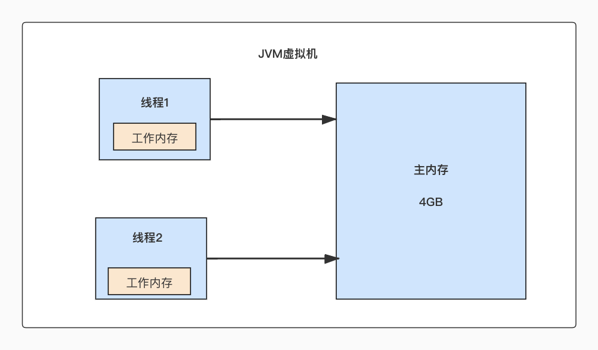
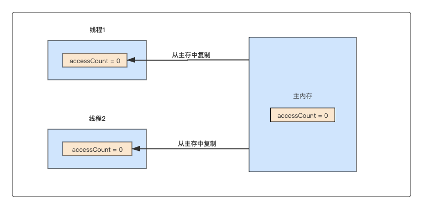
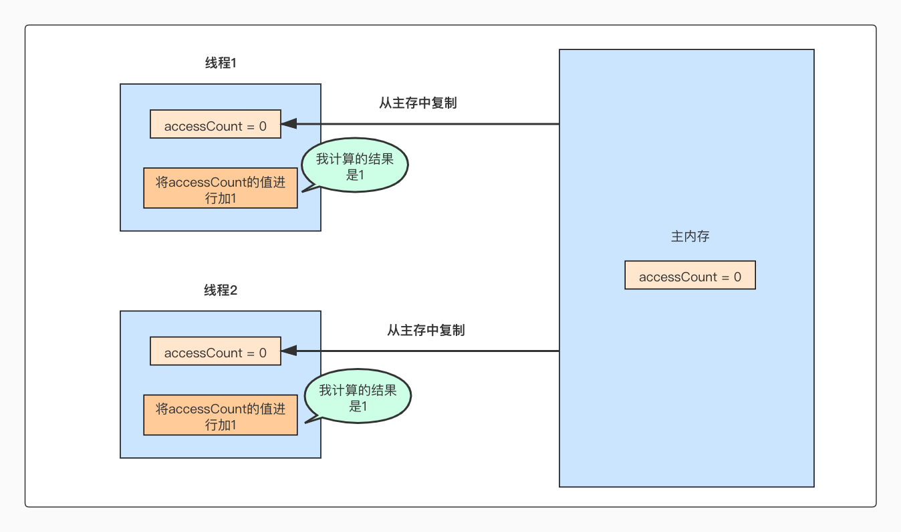
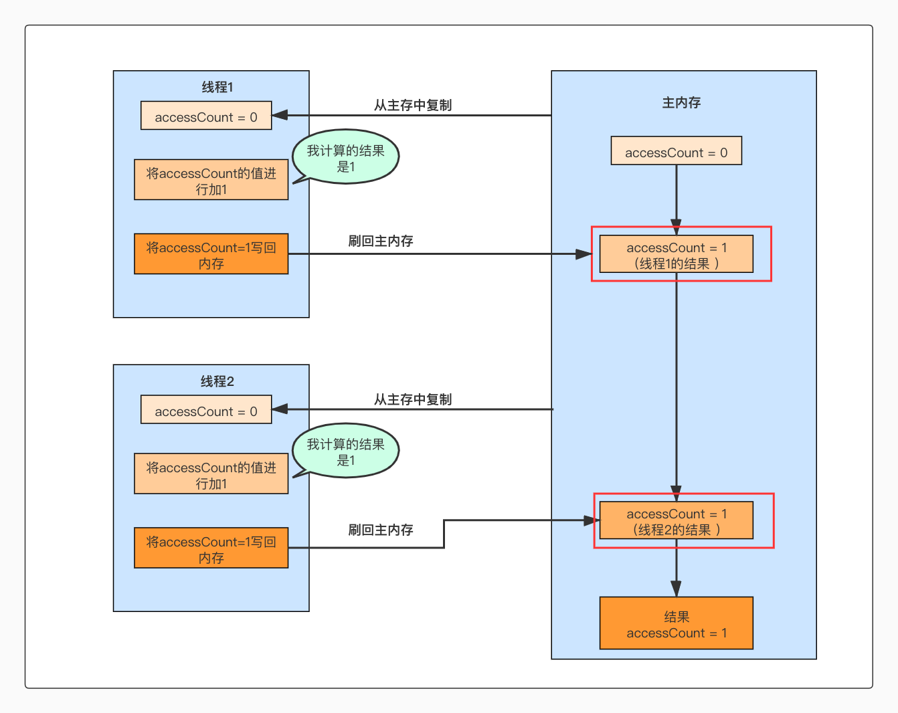

# **01_问题引入：多个线程读写同一共享变量是否存在并发问题？**

**儒猿架构官网上线**，内有石杉老师架构课最新大纲，儒猿云平台详细介绍，敬请浏览

官网：[www.ruyuan2020.com](http://www.ruyuan2020.com/)（**建议PC端访问**）

## 一、经典面试题 

有没有在JAVA笔试或面试中遇见过这样的题目：统计服务器某个接口的访问次数。

这时我们容易大手一挥写出来下面的代码：

这个类中accessCount字段表示接口被访问的次数， 每次访问接口的时候就调用一次access()方法，访问次数+1，累积下来，就能统计出接口被访问的次数了。

也许有些小白同学写出这样的方法会沾沾自喜，觉得离收到offer更进了一步，但是有点并发编程经验的同学都能想到这样一种常见的场景，就是接口很可能被多个线程同时访问，即access()方法被多个线程调用。那么问题来了：多线程调用access()方法时，接口访问次数统计的结果是否能保证准确呢？

答案显而易见：不能。

## 二、内存模型概念

接下来分析一下为什么上面统计的结果会有问题？我们先来简单理解一下内存模型的概念，大家都知道，我们的程序是运行在Java虚拟机上面的，Java虚拟机本身有自己的内存模型， Java的内存模型和计算机的CPU内存模型又有很多相同之处，这里的话，先稍微介绍一下CPU的内存模型。

计算机在执行程序的时候，每条指令都是在CPU中执行的，而在CPU执行指令的过程中会涉及到数据的读取和写入操作，而在计算机运行过程中所有的数据都是存放在主存中的(比如一台普通的4C8G机器，这个8G就是指主存的容量)，CPU则是从主存中读取数据进行运算。如图1：

图1

但是，这样会存在一个问题，由于CPU执行速度非常快，比计算机主存的读取和写入的速度快了很多，这样就会导致CPU的执行速度大大下降。

因此，每个CPU都会自带一个高速缓冲区，在运行的时候，会将需要运行的数据从计算机主存先复制到CPU的高速缓冲区中，然后CPU再基于高速缓冲区的数据进行运算，运算结束之后，再将高速缓冲区的数据刷新到主存中。这样CPU的执行指令的速度就可以大大提升。如图2：

图2

## 三、Java内存模型

JVM定义的内存模型和上面所说的内存模型有很多相似之处，只是JVM的内存模型屏蔽了不同的操作系统和底层硬件之间的内存访问差异，实现了在各个平台都能达到一致的内存访问效果。Java的内存模型如图3所示：

图3

JVM启动之后，操作系统会为JVM进程分配一定的内存空间，这部分内存空间就称为“主内存”。

另外Java程序的所有工作都由线程来完成，而每个线程都会有一小块内存，称为“工作内存”, Java中的线程在执行的过程中，会先将数据从主内存中复制到线程的工作内存，然后再执行计算，执行计算之后，再把计算结果刷新到“主内存”中。

好了，了解了Java的内存模型基本原理之后，我们再来分析一下接口访问计数器为什么统计结果不对。

## 四、基于内存模型一步一步分析缓存一致性问题

假设现在有两个线程同时访问了这个接口的access()方法，两个线程都执行了accessCount++，在内存中是怎么样执行的呢？

首先我们要明白，计算机需要执行accessCount++ 这个语句，需要分为以下3个步骤：

1. 从主存中读取accessCount的值
2. 将accessCount的值进行加1
3. 将accessCount的值写回主存中

先来看看第1步，假设两个线程同时来执行accessCount()方法，如图4：

图4

上面图4中在第1个步骤的时候，线程1和线程2都会把accessCount的值从主存中复制到线程所属的工作内存中，两个线程此时得到的accessCount的值都是0。

接着两个线程执行第2步操作：将accessCount的值进行加1。如图5所示：

图5

图5中，线程1和线程2都进行了第2步的计算，然后线程1得到的结果是 accessCount=1,线程2得到的结果也是accessCount=1。

接着两个线程都到了第三步：将accessCount的值写回主存中，如图6所示：

图6

线程1和线程2都计算完之后就会将计算结果刷新回主存，特别注意一下图中红框的内容，这是两个线程把计算结果刷新回主存的步骤，两个红框中操作的执行顺序不分先后(在实际运行情况，两个操作的顺序是随机的，可能是线程1先刷新，也可能是线程2先刷新)，但是这不影响结果，因为无论是线程1还是线程2，写回主存的结果都是accessCount=1。

但是实际上，我们观察到是2个线程都执行了一次access()方法，按照预期来说accessCount的值应该是等于2才对。

这种多个线程访问同一个对象时，调用这个对象的方法得到不正确的结果，这种问题称为线程安全问题。

通常来说，解决线程安全问题都有一些常见的解决方案，这部分内容会在下一篇文章详细分析，但是在此之前，我们可以思考一下我们这个线程安全问题为什么会产生呢？

回顾一下accessCount++这个代码，需要分为3个步骤：

1、从主存中读取accessCount的值

2、将accessCount的值进行加1

3、将accessCount的值写回主存中

经过我们前面的分析，思考一下，如何才能让计算结果为accessCount=2呢？

很显然，如果线程2能等待线程1把3个步骤都执行完，线程2才开始执行第1个步骤就可以得到正确的答案。也就是说，假如能将这3个步骤看做一个整体，要不全部执行完、要不全部不执行，就能解决问题了。

这里需要引申出一个并发中很重要的概念：原子性

原子性即一个操作或者多个操作，要么全部执行并且执行的过程不会被任何因素打断，要么就都不执行。

对应前面的场景，就是如果我们能保证accessCount++这个操作的3个步骤是原子性的，比如线程1开始了第一个步骤，那线程2如果要执行的话那就等着吧，等到线程1把3个步骤都执行完，线程2才能开始第一个步骤。那这样就能解决线程安全的问题了！

## 五、总结

总结一下本文的内容，首先从一个常见的面试题：统计服务器接口的访问次数，引出来了多线程并发访问共享变量的问题。

接着简单介绍了一下计算机CPU内存模型，在这基础上，咱们又去理解了Java的内存模型，紧接着基于Java的内存模型一步一图分析线程安全问题产生的原因。

最后提出一些解决问题的思路，从而引出并发编程中一个很重要的概念：原子性。下篇文章会对一些常见的并发问题进行分析，同时给出一些并发问题常见的解决方案。敬请期待，再见。

------

  儒猿技术窝精品专栏及课程推荐：

- [《从零开始带你成为消息中间件实战高手》](https://apppukyptrl1086.h5.xiaoeknow.com/v1/course/column/p_5d887e7ea3adc_KDm4nxCm?type=3)
- [《互联网Java工程师面试突击》（第2季）](https://apppukyptrl1086.h5.xiaoeknow.com/v1/course/column/p_5d3110c3c0e9d_FnmTTtj4?type=3)
- [《互联网Java工程师面试突击》（第1季）](https://apppukyptrl1086.h5.xiaoeknow.com/v1/course/column/p_5d3114935b4d7_CEcL8yMS?type=3)
- [《互联网Java工程师面试突击》（第3季）](https://apppukyptrl1086.pc.xiaoe-tech.com/detail/p_5dd3ccd673073_9LnpmMju/6?fromH5=true)
- [《从零开始带你成为JVM实战高手》](https://apppukyptrl1086.pc.xiaoe-tech.com/detail/p_5d0ef9900e896_MyDfcJi8/6)
- [《C2C电商系统微服务架构120天实战训练营》](https://apppukyptrl1086.h5.xiaoeknow.com/v1/course/column/p_5f1e9ddbe4b0a1003cafad34?type=3)
- [《基于RocketMQ的互联网酒店预订系统项目实战》](https://apppukyptrl1086.h5.xiaoeknow.com/v1/course/column/p_5fd03fb3e4b04db7c093b40c?type=3)