# **02_锦囊妙计：解决并发问题的方法有哪些？**

------

**儒猿架构官网上线**，内有石杉老师架构课最新大纲，儒猿云平台详细介绍，敬请浏览

官网：[www.ruyuan2020.com](http://www.ruyuan2020.com/)（**建议PC端访问**）

## **一、前文回顾**

上一篇文章我们提到多线程读写共享变量时，由于多个线程同时操作主内存中的共享变量时，会把其拷贝到每个线程的工作内存中进行操作，所以会出现缓存不一致的问题。

本篇文章我们将盘点一下常见并发问题的解决方法有哪些? 这里用一张图说明：

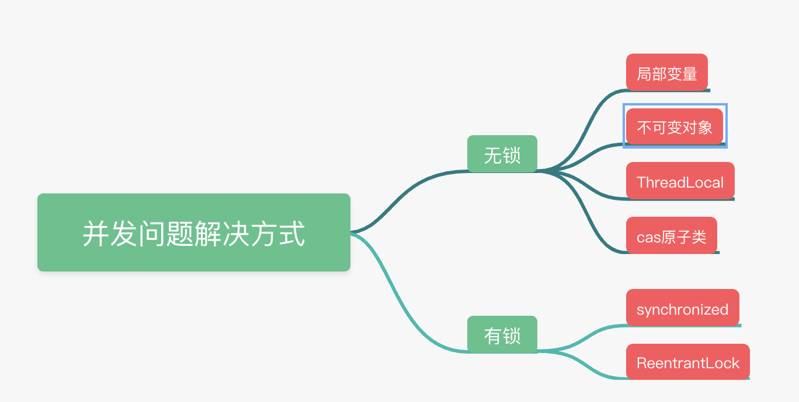

图1

从上图我们看到，解决并发问题的方法分为两大类：无锁和有锁。无锁可分为：局部变量、不可变对象、ThreadLocal、CAS原子类；而有锁的方式又分为synchronized关键字和ReentrantLock可重入锁。

下面我们来分析下为什么这些方法能解决并发问题？

首先需要声明的是，这些方法都需要在合适的场景下使用才能发挥作用。在下面的内容中，我们会用常见的例子来讲解每种方法，保证大家能有所收获。

## 二、局部变量

大家看到这个标题可能会觉得奇怪，为什么局部变量能解决并发问题呢？其实严格来说，是“善用局部变量可以避免出现线程安全问题”。因为局部变量仅仅存在于每个线程的工作内存中，假设有2个线程执行如下代码：

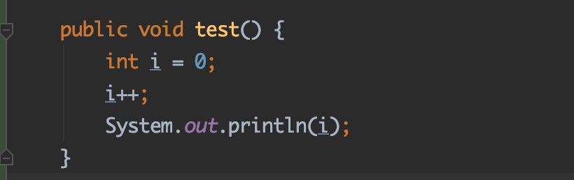

只有当每个线程都执行到“int i =0”这一行代码的时候，会在各自线程所在的工作内存中创建这个变量，如下面图2所示：

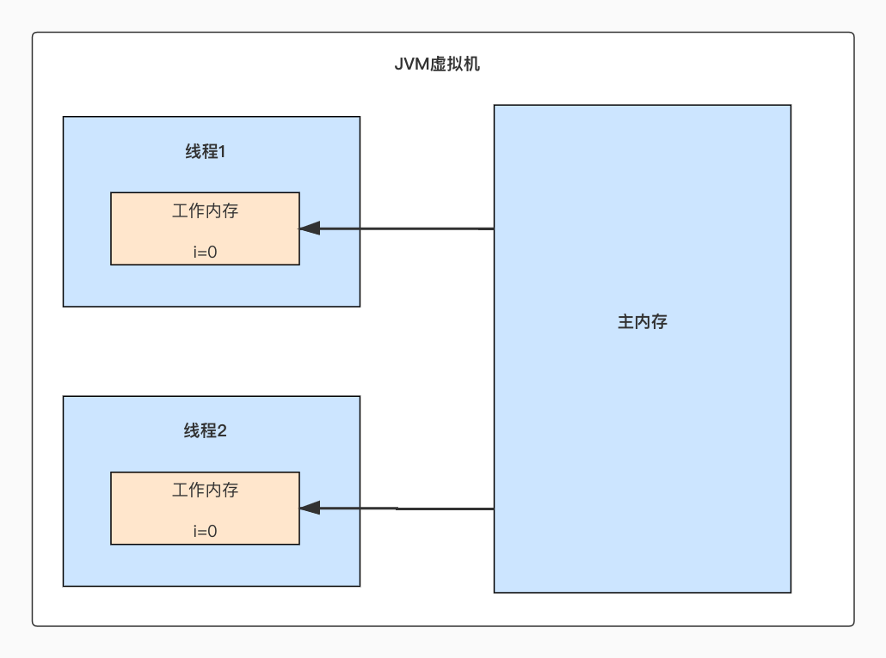

图2

看到这里你有没有恍然大悟的感觉？原来每个线程都只在自己的工作内存操作各自变量“i”, 不同线程之间的“i”根本没有任何交集，所以也就不存在的并发问题了。

## 三、不可变对象

所谓的不可变对象是指一经创建，就对外的状态就不会改变的对象。如果一个对象的状态是亘古不变的，那么自然就不存在什么并发问题了。因为对象是不可变的，所以无论多少个线程，对它做什么操作，它都是不变的。

举个例子，我们常用的字符串对象就是一个不可变对象，比如：String s=“Hello” ，注意这里的字符串是指“Hello”，而不是指引用“Hello”这个字符串的变量s，即便我们使用“Hello” 这个字符串和字符串“World”组合得到一个新的字符串“HelloWorld”，原本的“Hello”字符串也不会发生变化，这就是咱们说的不可变对象。

## 四、ThreadLocal

ThreadLoca本质上也是在每个线程有自己的一个副本，每个线程的副本是互不影响，没有任何关系的。

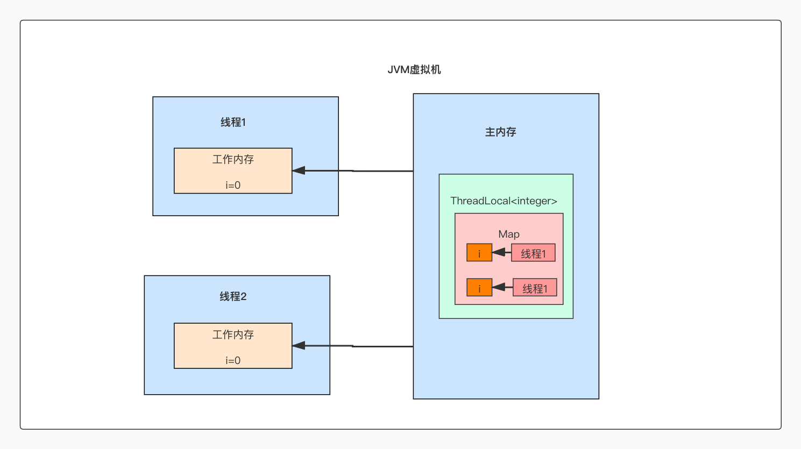

图3

如图3所示，一个命名为“i”的ThreadLocal类，它会在每个线程都有一个Integer的对象，虽然每个线程都会从主存内中把Integer对象拷贝到工作内存中，但是线程1和线程2拷贝过来的对象并不是同一个对象，其中每个对象只会被其中一个线程操作，这种场景不存在所谓的“共享变量”，也就不存在并发问题了。

## 五、cas原子类

CAS的意思是Compare And Swap，英文翻译过来的意思是“比较并置换”，CAS机制当中使用了3个基本操作数：内存地址V，旧的预期值A，要修改的新值B，只有当内存地址V所对应的值和旧的预期值A相等的时候，才会将内存地址V对应的值更新为新的值B。

在Java中的实现则通常是指以英文Atomic为前缀的一系列类，它们都采用了CAS的思想。

Atomic系列的使用的是一种无锁化的CAS操作，是基于乐观锁的，它的并发性能比较高，可以多个线程同时执行，并且保证不会出现线程安全问题。

让我们来看看AtomicInteger的简单使用：

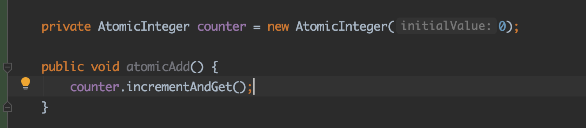

首先声明一个AtomicInteger counter的成员变量，接着在atomicAdd()方法中调用incrementAndGet()，atomicAdd 即使是被多线程调用，也不会有并发问题。

再让我们来看看AtomicInteger的源码：
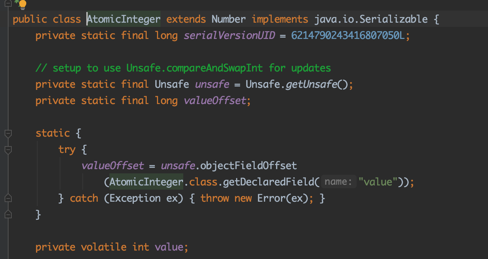

可以看到在源码内部存在一个Unsafe的实例，Unsafe类提供硬件级别的原子操作，因为Java无法直接访问到操作系统底层的硬件，为此Java使用native方法来拓展这部分功能，其中Unsafe类就是一个操作入口。Unsafe提供了几种功能，其中包括分配和释放内存，挂起和恢复线程，定位对象字段内存地址，修改对象的字段值，CAS操作。

其中我们主要用到的是Unsafe的CAS操作，其中主要是调用了unsafe的getAddnt方法：

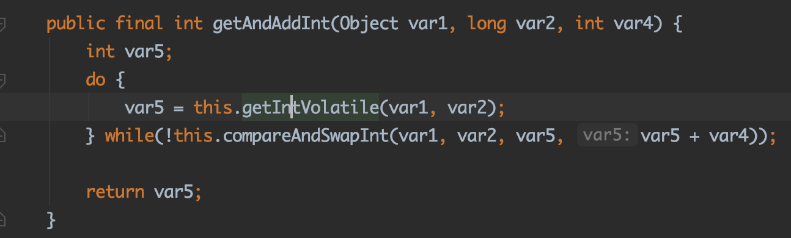

可以看到首先通过var5这个变量获取到旧的值，接着调用compareAndSwapInt方法通过

CAS操作来对数据进行比较并置换，如果操作失败了，会进入while循环，直到操作成功，其中compareAndSwapInt方法是一个native方法，底层是通过C++来实现的，它可以保证整个操作是原子性的，从而避免并发问题。

我们再来回顾一下上一篇文章提到的面试题：统计某个接口的访问次数。如果采用Atomic系列的原子类对代码进行改写的话，就不会有并发问题了：

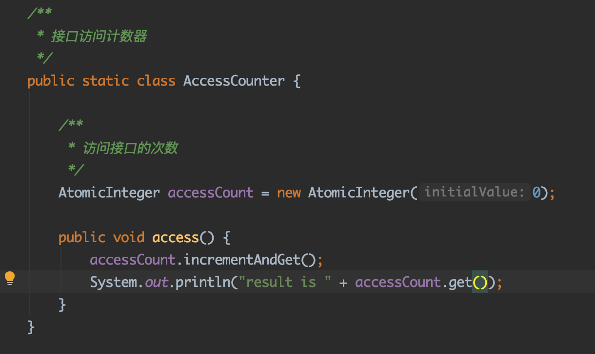

实际运行情况如图4：

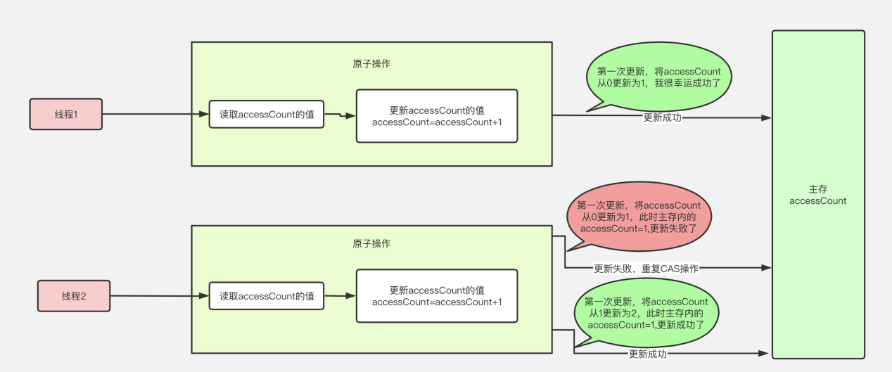

图4

有2个线程同时去调用access()方法，其中图4中中间淡绿色区域的操作是原子操作，要不全部都执行，要不全部不执行。

假设此时主存的accessCount的值为0，线程1和线程2同时通过CAS对accessCount的值进行累加，线程1和线程2都需要将accessCount从0更新到1，结果线程1很幸运地成功了，将accessCount的值更新为1。而线程2就失败了，线程2失败后会再次通过CAS操作进行累加，这时线程2重新读取最新的accessCount的值为1，接着将accessCount的值从1更新为2，最后咱们就得到了准确的计算结果。

下次再遇见这样的面试题，咱们就可以自信满满了。

## 六、Synchronized/ReentrantLock加锁

Synchronized和ReentrantLock都是采用了悲观锁的策略。因为他们的实现非常类似，只不过一种是通过语言层面来实现(Synchronized)，另一种是通过编程方式实现(ReentrantLock)，所以咱们把两种方式放在一起分析了。

先来看看一个i++的例子，通过这两种方式都能保证线程安全：

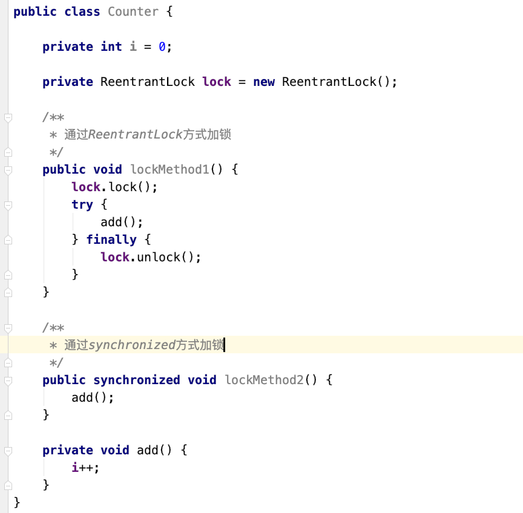

代码中lockMethod1使用了ReentrantLock的方式对累加操作进行加锁，在lock()方法调用之后和unlock方法调用之前的代码能够保证执行的时候是原子性的。如果多个线程同时调用lockMethod1的话，也不会存在线程安全问题。

lockMethon2中，直接在方法上加了synchronized关键字，意味着这个方法在执行的时候也是原子性的，也同样不会存在线程安全问题。

在i++这个操作上面，主要分为3个步骤：

\1. 读取i的值

\2. 将i的值加1

\3. 将i的值写回主存中

这上面的3个操作都通过加锁可以保证是原子性的，要么3个操作都执行，要么3个操作都不执行，所以可以解决线程安全问题。

加锁的原理如图5：

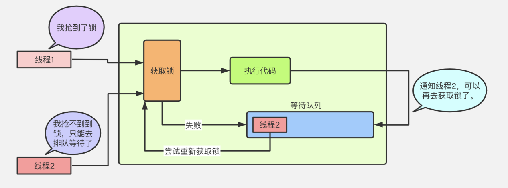

图5

首先两个线程都去争抢同一个锁，假设线程1获取到了锁，而线程2获取不到锁，就会进入等待队列，等到线程1，执行完代码逻辑之后，会去通知线程2：嘿，哥们，我用完了，你可以去尝试获取锁了，这时线程2会重新尝试去获取锁，假如线程2获取锁成功，线程2才开始执行代码。

## 七、总结 

最后做一下小结，本篇文章介绍了一些常见的解决并发问题的方法，这些方法分为无锁和有锁两大类，其中无锁的方法有采用局部变量、ThreadLocal、不可变对象、CAS原子类等形式的方法；而有锁的方法也可分为通过Synchronized的方式和ReentrantLock的方式。文中分别对这些方法进行了介绍，并且通过画图和代码分析其中的实现原理，希望大家能好好学习，理解吸收这些内容。

下篇文章我们会继续讲解“不可变对象”，来一个小小的实战，敬请期待，再见。

------

  儒猿技术窝精品专栏及课程推荐：

- [《从零开始带你成为消息中间件实战高手》](https://apppukyptrl1086.h5.xiaoeknow.com/v1/course/column/p_5d887e7ea3adc_KDm4nxCm?type=3)
- [《互联网Java工程师面试突击》（第2季）](https://apppukyptrl1086.h5.xiaoeknow.com/v1/course/column/p_5d3110c3c0e9d_FnmTTtj4?type=3)
- [《互联网Java工程师面试突击》（第1季）](https://apppukyptrl1086.h5.xiaoeknow.com/v1/course/column/p_5d3114935b4d7_CEcL8yMS?type=3)
- [《互联网Java工程师面试突击》（第3季）](https://apppukyptrl1086.pc.xiaoe-tech.com/detail/p_5dd3ccd673073_9LnpmMju/6?fromH5=true)
- [《从零开始带你成为JVM实战高手》](https://apppukyptrl1086.pc.xiaoe-tech.com/detail/p_5d0ef9900e896_MyDfcJi8/6)
- [《C2C电商系统微服务架构120天实战训练营》](https://apppukyptrl1086.h5.xiaoeknow.com/v1/course/column/p_5f1e9ddbe4b0a1003cafad34?type=3)
- [《基于RocketMQ的互联网酒店预订系统项目实战》](https://apppukyptrl1086.h5.xiaoeknow.com/v1/course/column/p_5fd03fb3e4b04db7c093b40c?type=3)