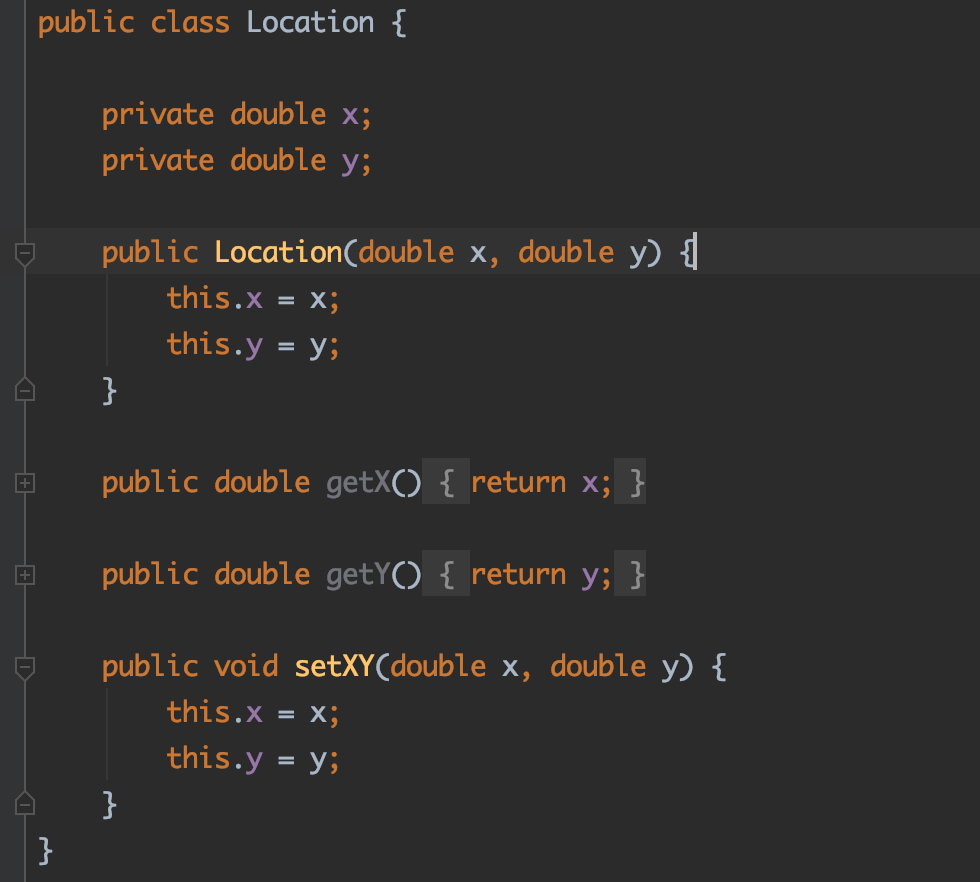
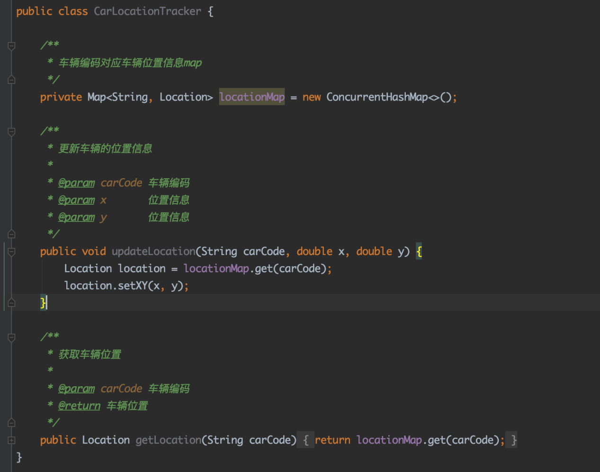
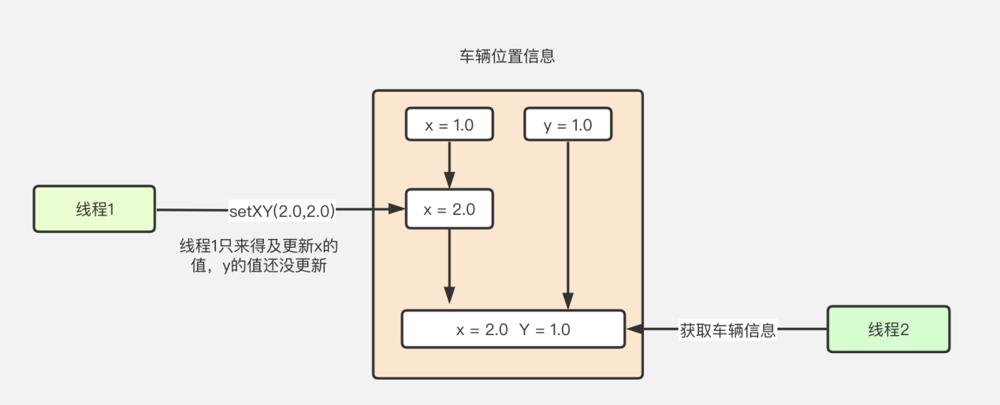
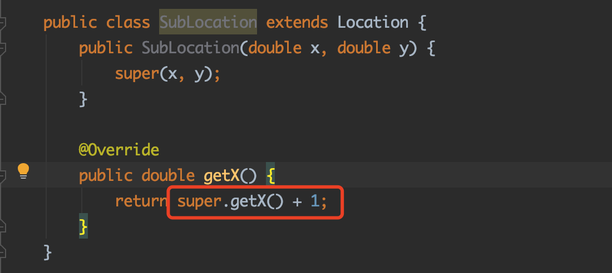
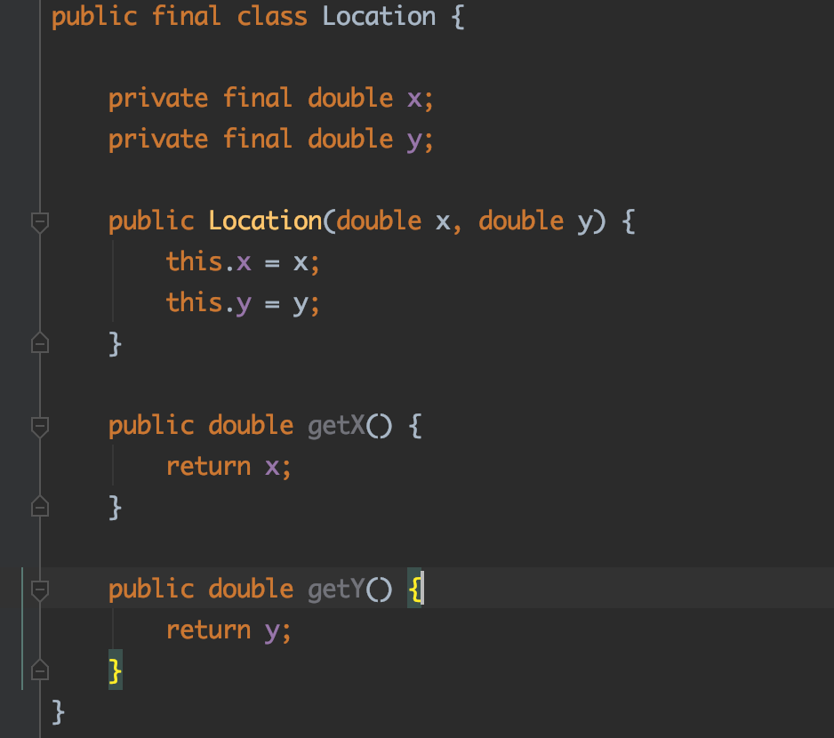
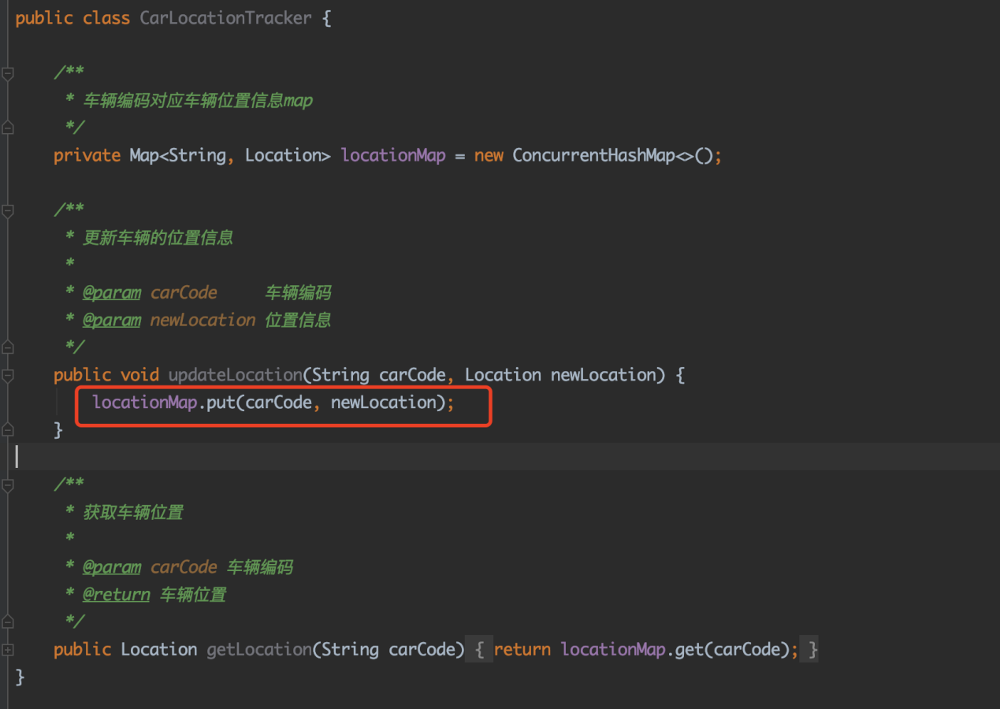
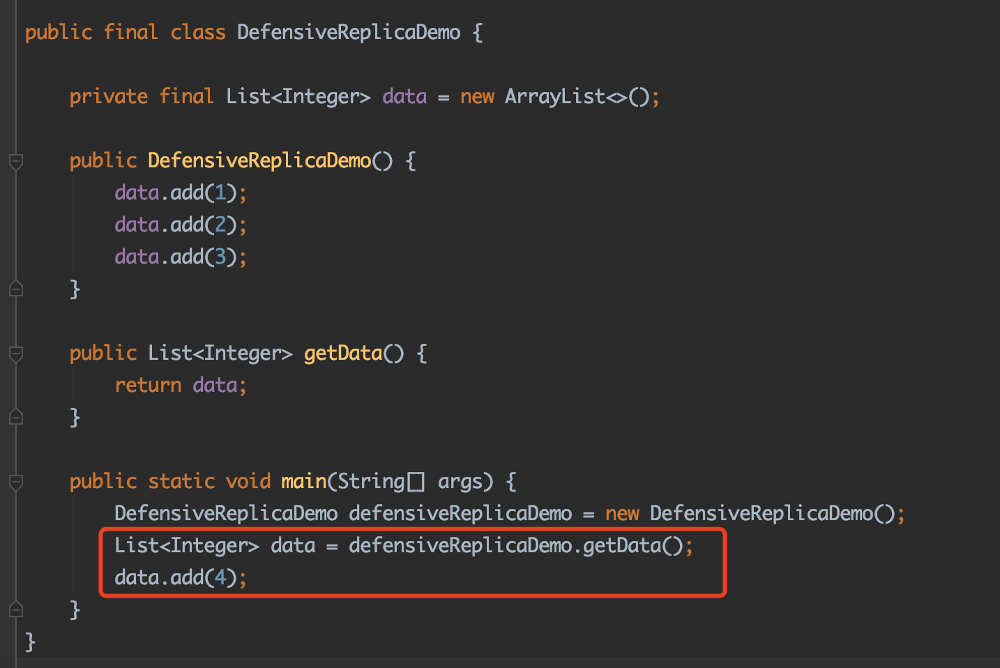

# **03_小试牛刀：如何快速实现一个不可变类？**

------

**儒猿架构官网上线**，内有石杉老师架构课最新大纲，儒猿云平台详细介绍，敬请浏览

官网：[www.ruyuan2020.com](http://www.ruyuan2020.com/)（**建议PC端访问**）

## 一、案例分析

今天这篇文章我们将通过一个车辆管理系统的案例讲解实现不可变类的思路。在这个案例中，需要对车辆的信息进行跟踪，其中车辆的位置信息的代码如下图（图1）：

 

图1

图中是一个位置信息类，包含代表坐标的变量X和Y，和用来对车辆位置信息进行更新的方法setXY，接下来我们看下实现车辆信息追踪代码（图2）：

图2

当车辆的位置信息发生变更的时候，我们可以调用updateLocation方法来更新车辆的位置，另外也可以通过调用getLocation方法来获取车辆的信息。

但Location类的setXY方法不是一个线程安全的方法，我们可以参考下图（图3）做一下具体分析：

图3

如图3所示，一开始某辆车的位置信息为x=1.0 y=1.0，接着线程1调用updateLocation方法来更新位置信息为x = 2.0，y = 2.0 ，这时线程1只来得及更新了x的值，y的值还没有更新，好巧不巧，线程2也来读取车辆的位置信息，此时它得到的结果是 x =2.0，y = 1.0。 这可是这个车根本不曾到达过的“诗和远方”。

为了确保车辆信息的更新具备线程安全的特性，我们可以将位置信息类改造为不可变类，如果车辆的位置信息发生变化，咱们通过替换整个Location对象来实现，而不是通过setXY方法来实现。 

## 二、如何实现一个不可变类？

那么怎么将一个类改造为不可变类呢？所谓的不可变类是指一个对象一经创建就不再改变。

在我们车辆管理系统中来说就是Location类一旦创建就不能变了，不能改变X的值，也不能改变Y的值。

说到这就有点意思了，如果Location类中的X的值不能变，Y的值也不能变，那么我们是不是可以使用Java的关键字final来修饰这两个字段，通过Java语言的语法特性来保证这两个字段的不可变，如图4:

图4

接着还是说X和Y的值不能改变，这个时候setXY方法的存在是不是不太合理？所以需要将setXY方法也去掉。

## 三、继续思考：如果当前类被子类继承还是一个不可变类吗？ 

接着我们再思考一个问题：假设我有一个子类继承了Location，然后重写了它的getX方法怎么办？如图5：

图5

如图5所示，假设有人继承Location类，然后重写getX方法。比如说我本来一个Location对象的X值为1的，但是这个子类确返回了 1 + 1 = 2。这很显然不符合不可变对象的行为，因为它的子类可以改变它的方法行为。 为了杜绝这种情况，我们需要将Location类设计为不可继承的，通过final修饰符修饰即可。

那么最终版本的不可变的Location如图6：

图6

接着，如果车辆位置发生变化的时候，通过替换整个Location来表示，这样就能避免前面的问题了。

图7

如图7中，如果车辆位置发生了变化，可以通过替换整个Location从而避免线程安全问题。

## 四、回头看看：如何将一个类改造成不可变类？

通过上面的例子，我们大概了解了使用可变的类会引发什么样问题，以及如何将一个类改造成不可变类，来解决线程安全问题。最后我们总结一下实现不可变类的一些思路：

1. 使用final关键字修饰所有成员变量，避免其被修改，也可以保证多线程环境下被final关键字修饰的变量所引用的对象的初始化安全，即final修饰的字段在其他线程可见时，必定是初始化完成的。
2. 使用private修饰所有成员变量，可以防止子类及其他地方通过引用直接修改变量值。
3. 禁止提供修改内部状态的公开接口(比如我们前面例子中的setXY方法)
4. 禁止不可变类被外部继承，防止子类改变其定义的方法的行为。
5. 如果类中存在数组或集合，在提供给外部访问之前需要做防御性复制

前面4点比较好理解，我们在前面改造Location为不可变类的过程中都有运用到，第5点则需要另外做一下说明

图8

如图8所示，DefensiveReplicaDemo类中有一个List<Integer>类型的数据，使用了final关键字修饰，其中数据内容为1，2，3(构造函数添加进去的)。并且提供了一个getData()的方法。

注意看红框内的代码，调用了data.add(4)，因为返回的是一个引用，指向的对象和DefensiveReplicaDemo类中的data指向的对象是同一个，这样就会导致DefensiveReplicaDemo类中的data数据内容改变为1，2，3，4。 为了避免这种情况，我们通常会做防御性复制，如图9：

图9

图9中，在返回data之前，创建了一个新的List对象返回，并且使用Collections.unmodifiableList方法进行包装，这样能保证外部无法修改我们返回的结果，那么DefensiveReplicaDemo的data集合的值永远会是1，2，3。

## 五、总结

小结一下，本文我们通过一个车辆管理系统追踪车辆位置信息的案例引出可变类存在什么问题，然后介绍如何一步一步的将可变的Location类改造为不可变类，从而避免线程安全问题。最终提纲挈领的概括了一下实现不可变类的一些要点。

------

  儒猿技术窝精品专栏及课程推荐：

- [《从零开始带你成为消息中间件实战高手》](https://apppukyptrl1086.h5.xiaoeknow.com/v1/course/column/p_5d887e7ea3adc_KDm4nxCm?type=3)

- [《互联网Java工程师面试突击》（第2季）](https://apppukyptrl1086.h5.xiaoeknow.com/v1/course/column/p_5d3110c3c0e9d_FnmTTtj4?type=3)

- [《互联网Java工程师面试突击》（第1季）](https://apppukyptrl1086.h5.xiaoeknow.com/v1/course/column/p_5d3114935b4d7_CEcL8yMS?type=3)

- [《互联网Java工程师面试突击》（第3季）](https://apppukyptrl1086.pc.xiaoe-tech.com/detail/p_5dd3ccd673073_9LnpmMju/6?fromH5=true)

- [《从零开始带你成为JVM实战高手》](https://apppukyptrl1086.pc.xiaoe-tech.com/detail/p_5d0ef9900e896_MyDfcJi8/6)

- [《C2C电商系统微服务架构120天实战训练营》](https://apppukyptrl1086.h5.xiaoeknow.com/v1/course/column/p_5f1e9ddbe4b0a1003cafad34?type=3)

- [《基于RocketMQ的互联网酒店预订系统项目实战》](https://apppukyptrl1086.h5.xiaoeknow.com/v1/course/column/p_5fd03fb3e4b04db7c093b40c?type=3)

  