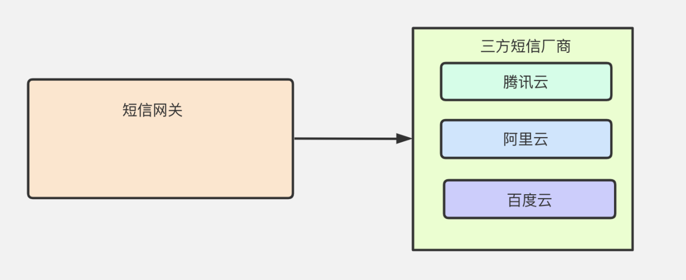
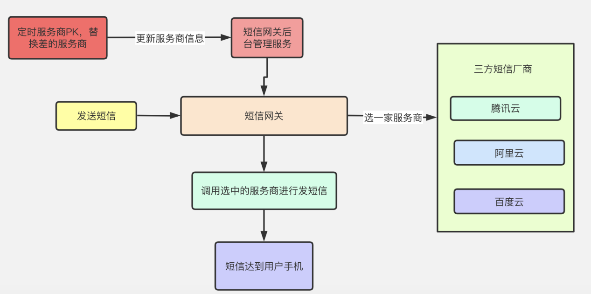
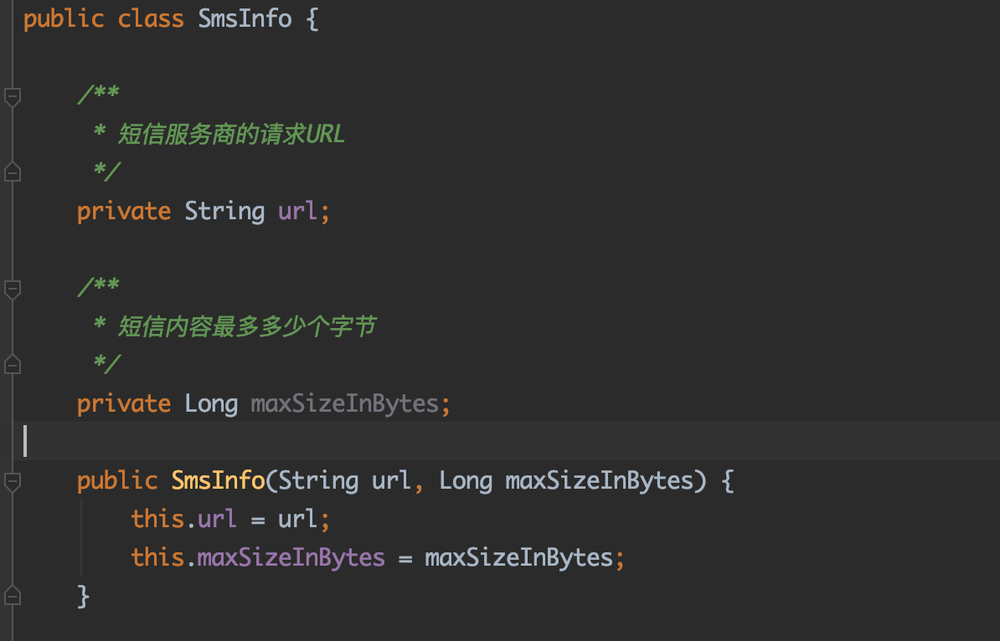
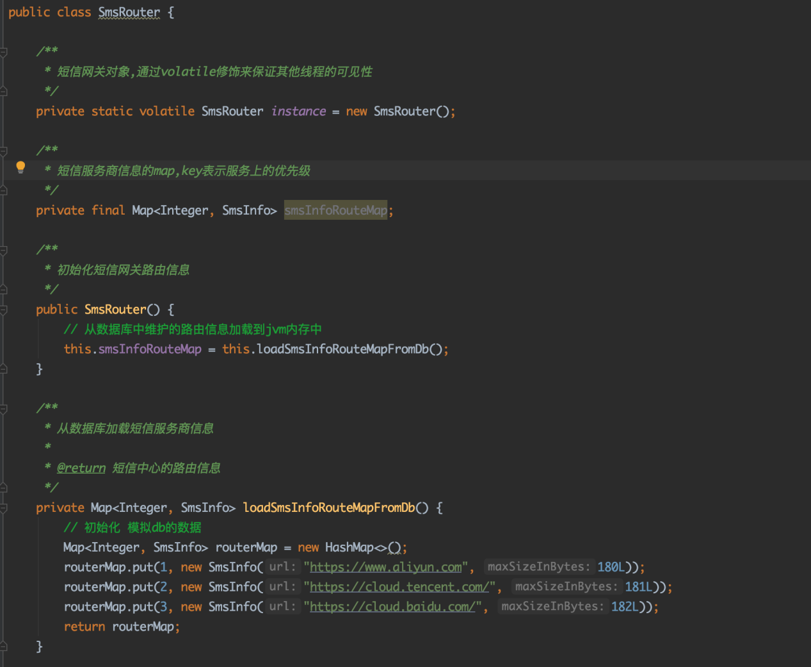
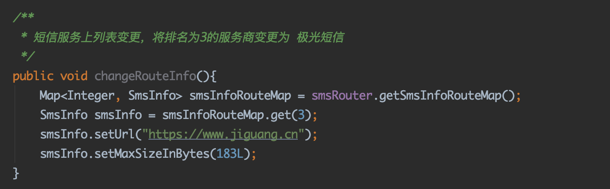
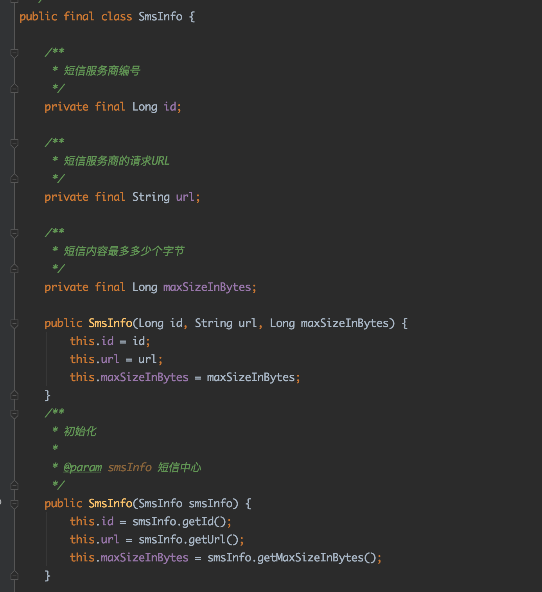
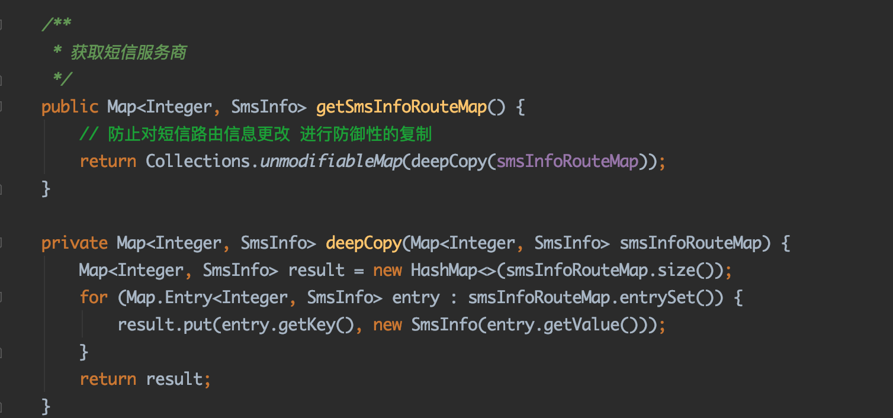
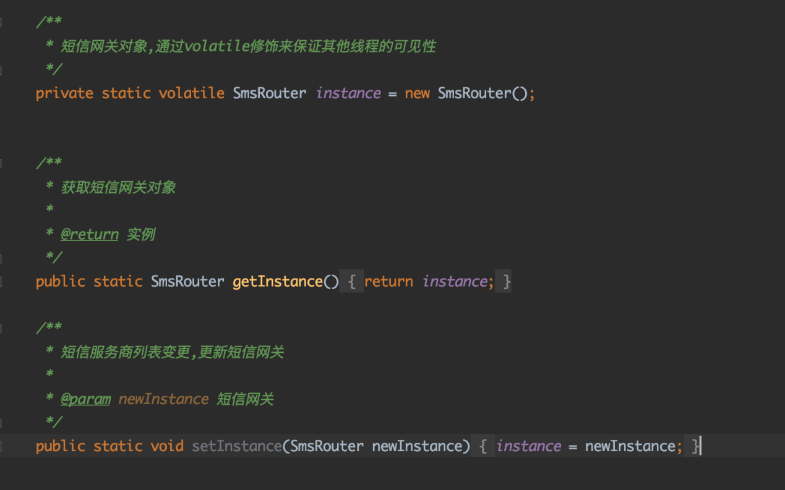
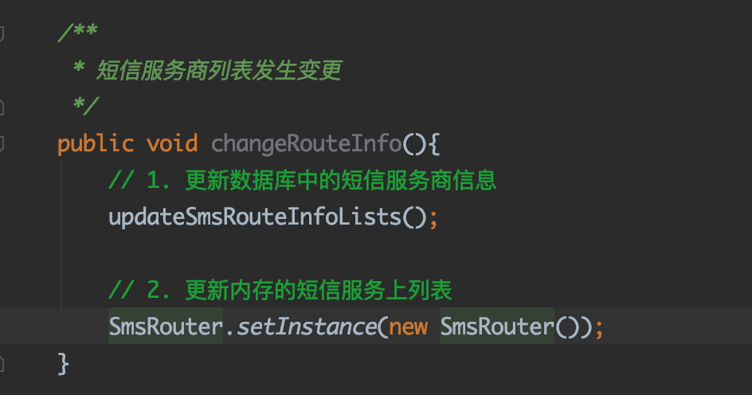

# **04_案例实战：百万流量的短信网关系统，如何基于不可变模式解决并发问题？**

------

**儒猿架构官网上线**，内有石杉老师架构课最新大纲，儒猿云平台详细介绍，敬请浏览

官网：[www.ruyuan2020.com](http://www.ruyuan2020.com/)（**建议PC端访问**）

## 一、上节回顾

通过前面一篇文章的学习，我们通过一个案例了解了可变类可能会导致什么样的线程安全问题，同时也学习了什么是不可变类，如何将一个可变类改造为一个不可变类。

本篇文章则继续基于一个真实的“百万流量的短信网关系统”，更深入地讲解如何通过不可变模式来解决并发问题的。

## 二、业务背景介绍

首先介绍一下业务背景，有一个每天有百万流量的短信网关系统，这个系统会使用第三方短信服务商（比如说阿里云、腾讯云、百度云等等）的短信发送功能。

图1

短信网关后面对接着多家三方短信服务提供商，当我们需要发送短信的时候，短信网关会根据一定的策略(比如说选择费率最低的、或者到达率最高的)从三方短信厂商中选择一家，调用他们的接口给用户发送短信。

另外因为短信服务厂商市面上有很多，所以我们系统需要根据公司运营情况对服务商进行PK，即对服务商进行多维度的考察，假设某个服务商的考察结果不尽人意，就会被替换掉。如图2所示

图2

图2中左上角会定时对短信服务上进行PK，如果发现某个服务商不行了，则会在短信网关后台管理服务中更新短信服务商列表，也就是把某些PK中输掉的服务商替换。

## 三、短信服务商基本信息

1、先来看看短信服务商的基本信息：

图3

如图3所示，短信服务商信息包括服务商请求的url以及每次发送的字节数量。

## 四、短信路由网关

再者短信服务上服务商信息列表是保存在数据库中的，由于这个数据会比较常用，而每次发送短信之前都需要根据一定的策略来选择服务商，所以在系统启动的时候，会将所有的短信服务上列表从数据库中加载出来放在内存里，有一个叫做SmsRouter的类专门去做这个事情，代码如下图（图4）所示：

图4

如图4所示，SmsRouter在构造函数中调用了loadSmsInfoRouteMapFromDb方法，把短信服务商信息从数据库中加载到内存中(这里使用模拟的方式)，用字段smsInfoRouteMap保存。其中smsInfoRouteMap的Key为服务商排名。

当短信服务商发生变更的时候的时候，会先更新更新数据库，然后去更新内存中的短信服务商信息。

图5

图5中代码将服务商排名为3的服务商改为另外一个服务商。但是这里有一个问题，因为这里设置url和设置maxSizeInBytes并不是一个原子操作，可能出现其中一个线程刚刚设置了URL，另一个线程过来读取服务商排名为3的服务商的场景，这样读取排名为3的服务商得到的一个结果就是是：

SmsInfo(url = "https://www.jiguang.cn", 182)。

这个结果是一个中间状态，其中url和maxSizeInBytes并不是属于同一个服务商的，这样很可能会导致程序出现问题。

## 五、基于不可变模式改造代码

接下来需要使用不可变模式来改造代码，避免这样的线程安全问题，第一步先将SmsInfo改造为不可变对象，改造后的结果如下：

图6

图6中，将SmsInfo改造为不可变对象，声明这个类时使用final关键字修饰，表示其不可被继承，另外每个字段都使用了private final进行修饰。

接着在需要将获取服务商列表的代码改造为防御性复制，如图7所示

图7

在图7中，在返回smsInfoRouteMap数据之前，做了防御性复制，即便外部改变获取到对象的状态，也不会影响SmsRouter本身的smsInfoRouteMap数据。

接着提供一个直接替换SmsRouter实例的方法，便于用来刷新整个服务商信息：

图8

在短信服务商发生变更的时候，代码如下：

图9

当短信服务商列表发生变化的时候，我们通过调用changeRouteInfo方法，更新数据库中的服务商信息，接着替换整个SmsRouter实例。

这样一来，SmsRouter在构造函数的时候会调用loadSmsInfoRouteMapFromDb方法将更新后的短信服务商列表从数据库中读取出来，然后更新到内存中。

到此为止，我们就通过不可变模式避免了短信网关中服务商列表更新的线程安全问题，这归功于短信服务上信息SmsInfo的不可变性，从而避免了修改SmsInfo在多线程环境下的线程安全问题，另外在SmsRouter获取服务上列表的过程中，对服务商列表进行了了防御性复制，避免外部其他的类对SmsRouter中的短信服务商列表的进行修改。

## 六、总结

当然了，有人可能会想到：解决短信服务上更新的线程安全问题可以加锁啊！通过加锁的方式实现当然也是可以的，但是我们这篇文章主题是通过不可变类来避免线程安全问题，所以这里演示的是通过不可变对象的方式，其实两种方式都可以，本篇文章只是提供一个可行的方案。实现不可变类在实战中比较有用，希望大家能深入理解并灵活使用。

------

 儒猿技术窝精品专栏及课程推荐：

- [《从零开始带你成为消息中间件实战高手》](https://apppukyptrl1086.h5.xiaoeknow.com/v1/course/column/p_5d887e7ea3adc_KDm4nxCm?type=3)

- [《互联网Java工程师面试突击》（第2季）](https://apppukyptrl1086.h5.xiaoeknow.com/v1/course/column/p_5d3110c3c0e9d_FnmTTtj4?type=3)

- [《互联网Java工程师面试突击》（第1季）](https://apppukyptrl1086.h5.xiaoeknow.com/v1/course/column/p_5d3114935b4d7_CEcL8yMS?type=3)

- [《互联网Java工程师面试突击》（第3季）](https://apppukyptrl1086.pc.xiaoe-tech.com/detail/p_5dd3ccd673073_9LnpmMju/6?fromH5=true)

- [《从零开始带你成为JVM实战高手》](https://apppukyptrl1086.pc.xiaoe-tech.com/detail/p_5d0ef9900e896_MyDfcJi8/6)

- [《C2C电商系统微服务架构120天实战训练营》](https://apppukyptrl1086.h5.xiaoeknow.com/v1/course/column/p_5f1e9ddbe4b0a1003cafad34?type=3)

- [《基于RocketMQ的互联网酒店预订系统项目实战》](https://apppukyptrl1086.h5.xiaoeknow.com/v1/course/column/p_5fd03fb3e4b04db7c093b40c?type=3)

  