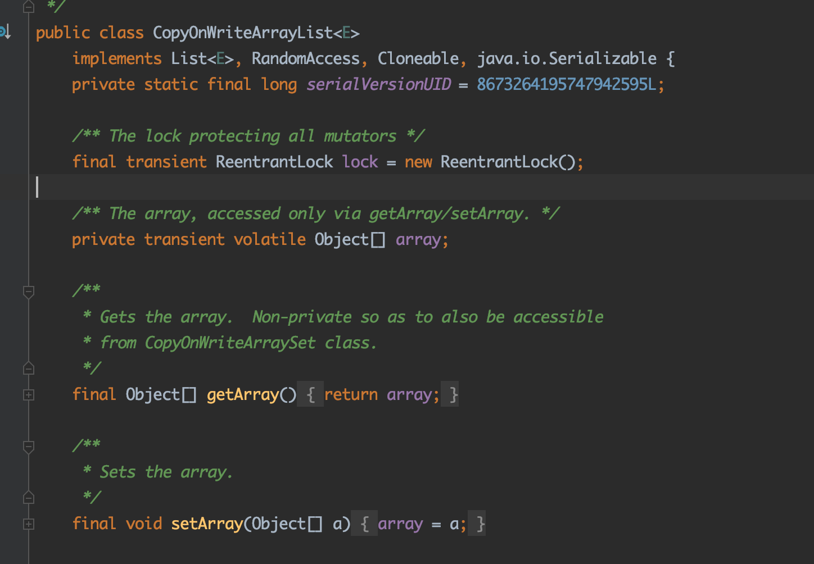
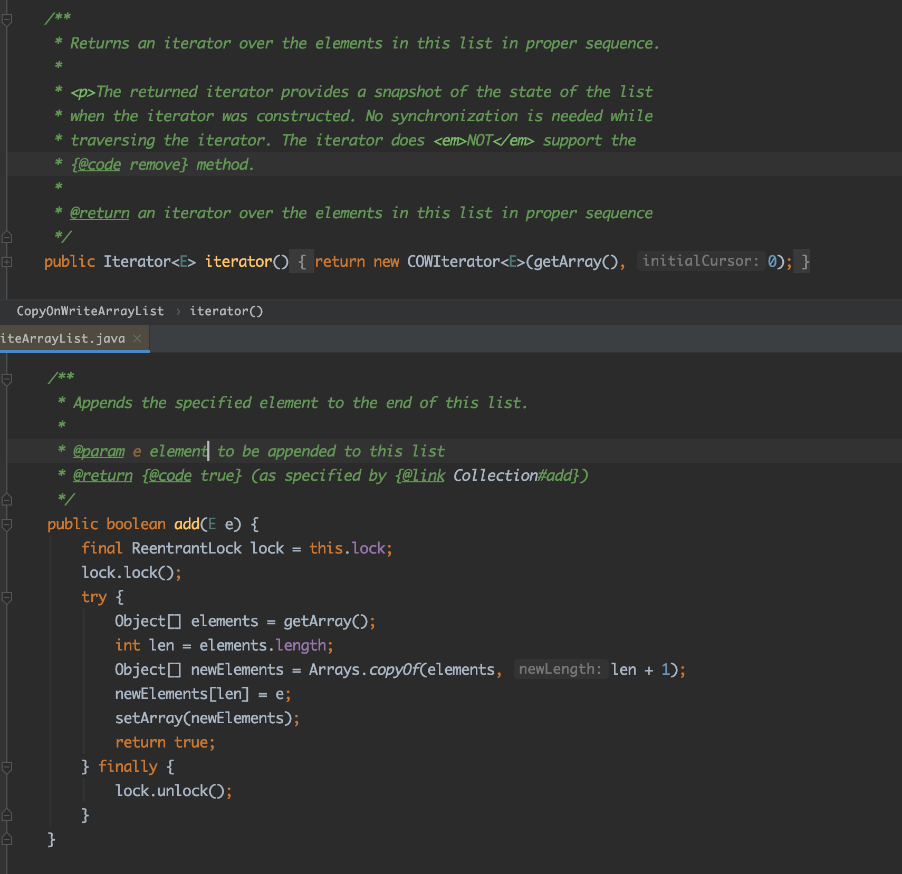
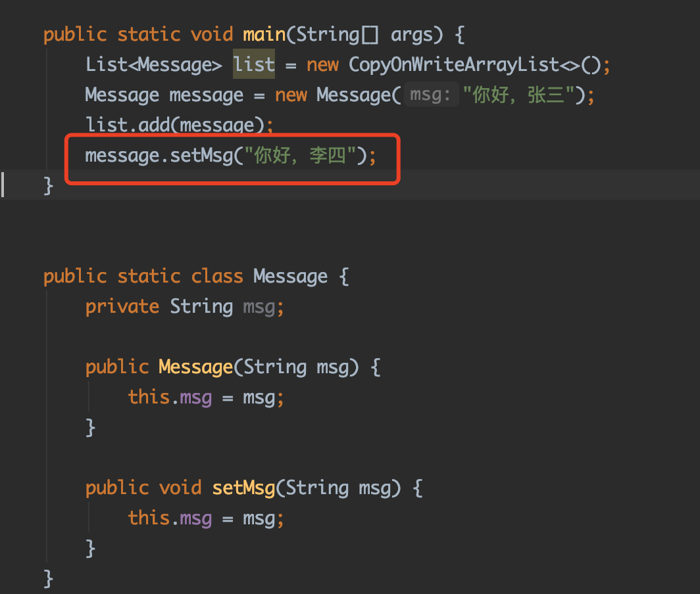
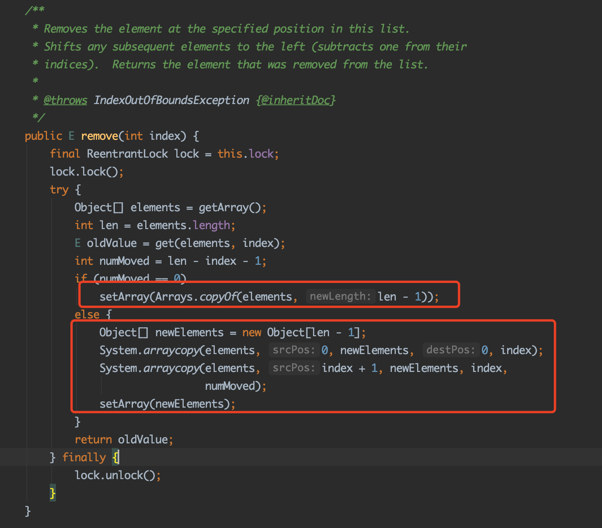
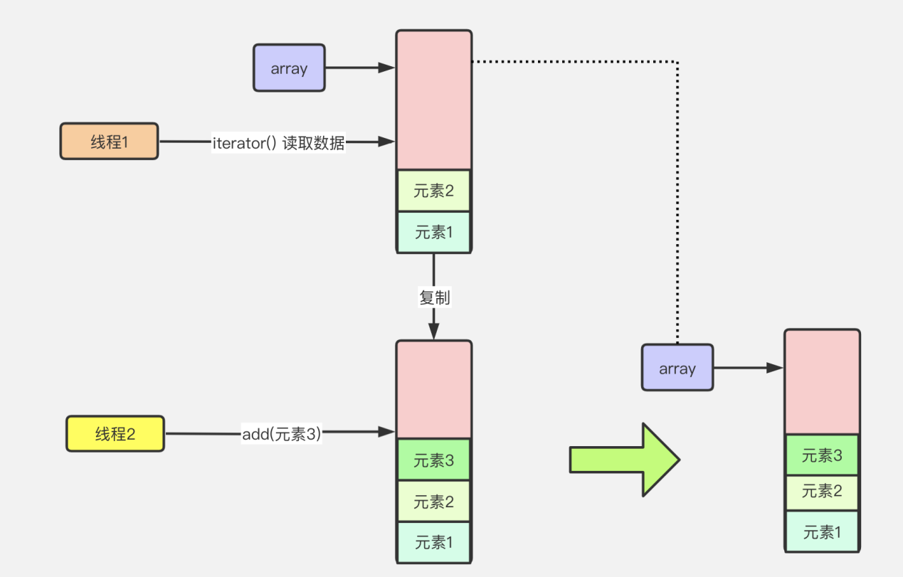
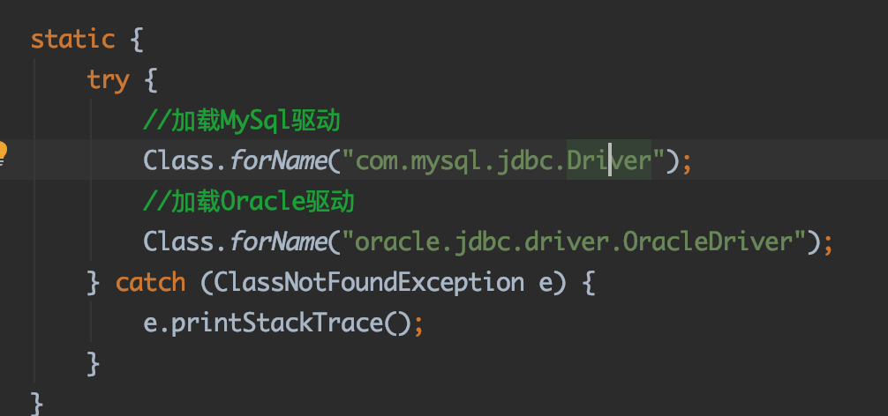
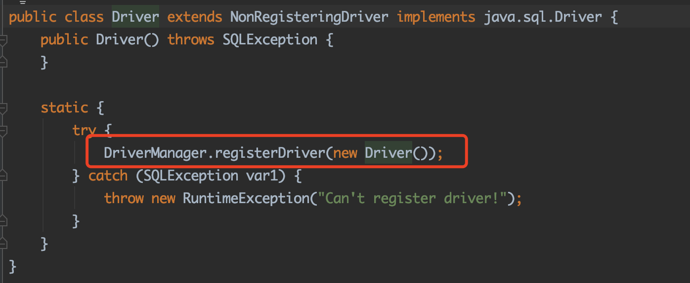
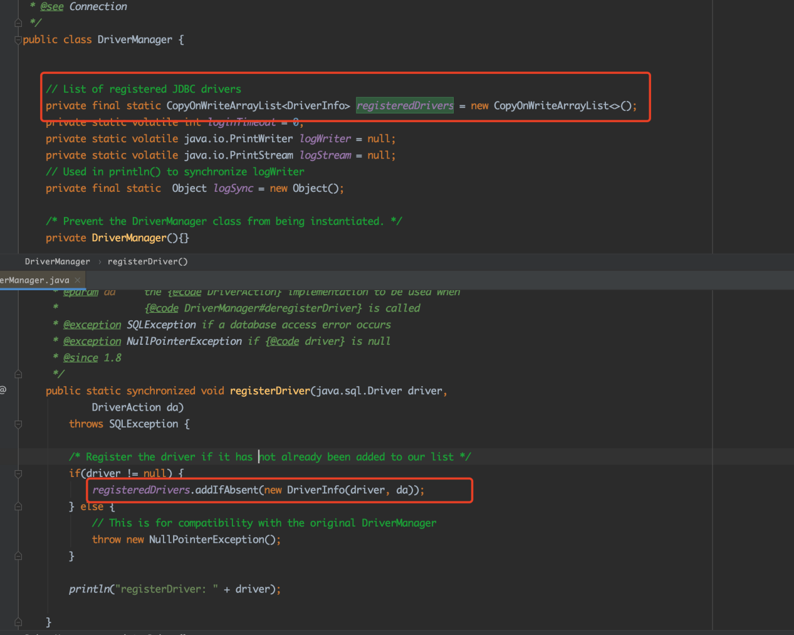
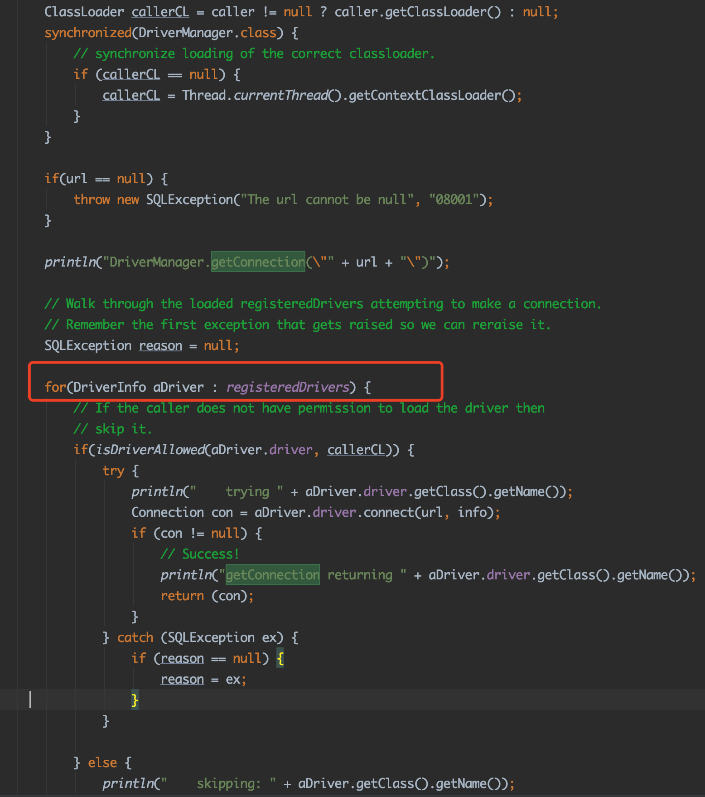

# **05_源码分析：等效不可变对象CopyOnWriteArrayList适用场景剖析**

**儒猿架构官网上线**，内有石杉老师架构课最新大纲，儒猿云平台详细介绍，敬请浏览

官网：[www.ruyuan2020.com](http://www.ruyuan2020.com/)（**建议PC端访问**）

## 一、开篇词

本篇文章我们分析一下等效不可变对象在在源码中的应用,主要是围绕CopyOnWriteArrayList的原理来展开，CopyOnWriteArrayList的源码中运用了不可变对象模式，使得集合在进行遍历操作的时候，不用加锁也能保证线程安全。

## 二、等效不可变对象

通过前面的文章分析，我们知道了什么是不可变对象，而等效不可变对象的意思就是说对象基本符合不可变对象的一些特征，但是某些情况下内部状态可能会改变，这样的解释可能有点难以理解，这里结合CopyOnWriteArrayList的代码来讲解，如图1所示：

图1

可以看到CopyOnWriteArrayList源码中维护一个array对象数组用于存储集合的每个元素，并且array数组只能通过getArray和setArray方法来访问。

接下来看看CopyOnWriteArrayList在进行数据遍历和新增一个元素的方法：

图2

在图2中，在调用iterator方法的时候，会通过getArray()方法获取array数组，然后基于这个数组进行遍历遍历。另外再新增一个元素，调用add方法的时候，也是通过getArray()获取到对象数组，然后直接新生成一个数组，最后把旧的数组的值复制到新的数组中，然后直接使用新的数组覆盖实例变量array。

## 三、回头看看：实例变量array就是一个等效不可变对象？

我们仔细思考一下，在array对象每次被创建之后，其内容就不再被改变。（数组的长度和每个元素都不变）。另外就算我们对CopyOnWriteArrayList进行集合元素的增删，这里也不是直接改变原数组的元素，而是直接新建了一个新的数组，替换掉array对象。在这个时候，旧的那个数组还是没有改变过。

但是这里会存在一些差异，因为实例变量array本质上是一个数组，而数组的各个元素都是一个对象，每个对象内部的状态是可以替换的。因此实例变量并非严格意义上的不可变对象，所以我们称之为等效不可变对象。

举个例子说明一下这种情况，如图3所示：

图3

我们有一个类Message，其中有一个字段叫做msg，这个字段通常情况下会在构造函数中指定，也可以通过setMsg方法设定。

我们首先创建了一个CopyOnWriteArrayList对象，然后新建了一个Message对象，其中msg的值为“你好，张三”, 接着我们将这个字段添加到CopyOnWriteArrayList中。此时

CopyOnWriteArrayList中的array内容大致如下：

array = [ Message{msg =“你好，张三”, hashCode = 001} ]

其中array数组不会再继续改变，这意味对于实例变量array来说，里面的元素不会改变(不会从hashCode为001的对象变成其他对象)，但是CopyOnWriteArrayList无法限制调用者

的一些行为，比如将 hashCode为001的对象中的msg字段的值改变。

如图3中红色框的代码，将msg字段设置为“你好，李四”。这样array的内容大致如下：

array = [ Message{msg =“你好，李四”, hashCode = 001} ]

可以看到，array数组所对应存储的对象是不可变的，但是存储的对象的内部状态是可能改变的，所以这种情况下array就被叫做等效不可变对象。

## 四、写时复制机制

通过前面的分析，我们了解了什么叫做等效不可变对象，但是CopyOnWriteArrayList的设计之精妙远不止于此，让我们再瞧一眼这个类的名字：CopyOnWrite，翻译过来就是“写时复制”，这个写时复制是CopyOnWriteArrayList设计的一大亮点。

我们回顾一下图2中对CopyOnWriteArrayList进行迭代和添加元素的代码：

图2

可以看到，我们对集合进行迭代的情况，本质上是一个读操作。而往集合中新增一个元素本质上是一个写操作。

写时复制机制主要体现在写操作上，从图2中代码可以看到，在进行写操作的时候，首先是基于array这份数据复制出来一份数据，接着在复制出来的数据基础上进行写操作。同理，我们看看另一种写场景: 删除一个元素

图4

如图4所示，主要看红色框，在移除一个元素的时候，最终都是基于原有的数组复制一个新的数组，然后直接用新的数据替换掉旧的数组。

写时复制的最终目的是为了在读多写少的场景，通过写时复制的机制，让大量的读请求在无需加锁牺牲性能的情况下保证多线程并发读写的情况下线程安全。

图4

图4中演示了两个线程并发读取CopyOnWriteArrayList的情况，其中线程1需要通过iterator()方法读取数据，其中集合中的元素为元素1、元素2，但是这个时候线程2需要往集合中添加一个元素：元素3，这个时候线程2的操作是直接基于集合当前的数据进行复制一份到新的一个数组，最后将array变量指向新的一个数组。

注意思考这样的一个场景：假设线程1在遍历元素的时候，读到了元素1，但是还没有读到元素2的时候，线程2添加了元素3，这个时候线程1是无法读取到元素3的。这是因为线程1和线程2操作的数组不是同一个数组。 这也是CopyOnWriteArrayList的一个特点：弱一致性。意思就是说线程1看到的是某一时刻的一份“快照数据”，无法保证能读取到最新的数据。

## 五、CopyOnWriteArrayList的使用场景

总的来说，CopyOnWriteArrayList适用于读多写少的场景，接下来我们看看CopyOnWriteArrayList的一些实际的运用场景，我们平时和数据库打交道想必不少，而使用Java语言操作数据库一般都是通过JDBC来实现。通常来说我们都要在程序启动的时候加载对应数据库的驱动，如图5所示：

图5

第一步需要加载对应的数据库驱动，比如MySql驱动或者Oracle驱动，现在Mysql数据库为主流数据库，所以我们看看Mysql的驱动程序：

图6

在图6中，Mysql的Driver有一块静态代码块，表示在加载类的时候会执行这段代码，最终执行了DriverManager的registerDriver程序。

图7

图7中registerDriver方法，实际上是往registerDrivers中添加了一个DriverInfo对象，而registerDrivers就是一个CopyOnWriteArrayList。

来分析一下，registerDrivers就是用来保存不同的数据库驱动的，而通常来说，一个项目上只有一个数据库类型，就算在一些复杂的场景下，可能一个项目对应多个数据库类型，有Mysql数据库也有Oracle数据库，甚至其他的一些数据库。但是无论有多少个数据库类型，数据库的驱动程序一般都是在程序启动的时候加载的，也就是说registerDriver方法一般来说都是在程序启动的时候进行调用的，在后续程序运行过程中一般不会再调用这个方法，这种场景完美符合“写少”的定义，基本上在程序运行过程中，不会再进行写操作(也就是add/remove等操作)

接下来我们在分析下读操作，什么情况下会对数据库驱动程序进行读取呢？在我们程序中需要调用JDBC得到数据库连接的时候，会去遍历所有的driver，然后找到一个driver，然后通过那个特定的driver来获取连接，代码如图8：

图8

在图8中，截取了一段getConnection方法的代码，可以看到红框中，对通过遍历registerDrivers，然后判断每个驱动程序能否被加载，如果可以加载就通过驱动程序来获取connection。这个getConnection方法会被频繁调用，因为一般开发一些项目的话，需要经常和数据库进行交互，会经常需要获取连接，所以getConnection的调用频率肯定会高一些。

JDBC驱动程序列表这种数据，因为驱动程序变更的情况比较少，但是遍历这个驱动程序列表的情况比较多，所以是符合读多写少的特性，所以这个使用CopyOnWriteArrayList来维护比较合适。

## 六、总结

在文章末尾，我们来回顾一下本篇文章的内容，首先我们通过CopyOnWriteArrayList来解释什么是不可变对象，接着通过分析写时复制机制，知道了CopyOnWriteArrayList的实现本质上是通过弱一致性提升读请求并发，适合用在数据读多写少的场景；最后通过了JDBC中的数据库驱动程序列表管理，分析这种数据的读多写少的特性，演示了源码中使用CopyOnWriteArrayList的场景。

------

 儒猿技术窝精品专栏及课程推荐：

- [《从零开始带你成为消息中间件实战高手》](https://apppukyptrl1086.h5.xiaoeknow.com/v1/course/column/p_5d887e7ea3adc_KDm4nxCm?type=3)

- [《互联网Java工程师面试突击》（第2季）](https://apppukyptrl1086.h5.xiaoeknow.com/v1/course/column/p_5d3110c3c0e9d_FnmTTtj4?type=3)

- [《互联网Java工程师面试突击》（第1季）](https://apppukyptrl1086.h5.xiaoeknow.com/v1/course/column/p_5d3114935b4d7_CEcL8yMS?type=3)

- [《互联网Java工程师面试突击》（第3季）](https://apppukyptrl1086.pc.xiaoe-tech.com/detail/p_5dd3ccd673073_9LnpmMju/6?fromH5=true)

- [《从零开始带你成为JVM实战高手》](https://apppukyptrl1086.pc.xiaoe-tech.com/detail/p_5d0ef9900e896_MyDfcJi8/6)

- [《C2C电商系统微服务架构120天实战训练营》](https://apppukyptrl1086.h5.xiaoeknow.com/v1/course/column/p_5f1e9ddbe4b0a1003cafad34?type=3)

- [《基于RocketMQ的互联网酒店预订系统项目实战》](https://apppukyptrl1086.h5.xiaoeknow.com/v1/course/column/p_5fd03fb3e4b04db7c093b40c?type=3)

  