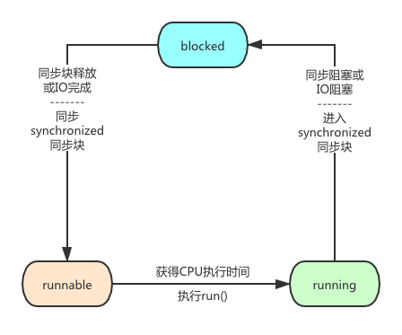

# **06_基础回顾：线程在执行过程中的状态是如何流转的？**

------

**儒猿架构官网上线**，内有石杉老师架构课最新大纲，儒猿云平台详细介绍，敬请浏览

官网：[www.ruyuan2020.com](http://www.ruyuan2020.com/)（**建议PC端访问**）


## **一、线程的生命周期** 

首先，我们了解下，Java线程在运行生命周期中可能处于的6种不同状态：


下面是JDK源码：src/main/java/java/lang/Thread.java 中 线程状态State枚举 代码：

```
public enum State {  
    NEW,    RUNNABLE,    BLOCKED,    WAITING, 
    TIMED_WAITING,    TERMINATED;
}
```


## 二、线程的状态流转图


## 三、线程各个状态说明

1、NEW（初始化状态） 

实现Runnable接口和继承Thread可以得到一个线程类，new一个实例出来，线程就进入了初始化状态。

我们用代码来实现下创建线程的2个过程

方法一：继承Thread类

```
public class ThreadTest extends Thread {
    private String name;
    public ThreadTest(String name) {
        this.name = name;
    }    public void run() {
        for (int i = 1; i < 11; i++) {
          System.out.println(Thread.currentThread().getName() + " thread " + i);
        }
    }
    public static void main(String[] args) {
        ThreadTest t1 = new ThreadTest("thread1");
        ThreadTest t2 = new ThreadTest("thread2");
        ThreadTest t3 = new ThreadTest("thread3");
        t1.start();
        t2.start();
        t3.start();
    }
}
```

方法二：实现Runnable接口

```
public class TestRunnable implements Runnable {  
    public void run() {
        for(int i=1;i<11;i++){
    		 System.out.println(Thread.currentThread().getName()+" thread "+ i);
        }
    }
    
    public static void main(String[] args) {
        Thread t1=new Thread(new TestRunnable(),"thread1");
        Thread t2=new Thread(new TestRunnable(),"thread2");
        Thread t3=new Thread(new TestRunnable(),"thread3");
        t1.start();
        t2.start();
        t3.start();
    }
}
```


 2、RUNNABLE（就绪，运行中状态） 

READY 就绪

1. 就绪状态只是说你自个儿运行，调度程序没有挑选到你，你就永远是就绪状态。
2. 调用线程的start()方法，此线程进入就绪状态。
3. 当前线程sleep()方法结束，其他线程join()结束，等待用户输入完毕，某个线程拿到对象锁，这些线程也将进入就绪状态。
4. 当前线程时间片用完了，调用当前线程的yield()方法，当前线程进入就绪状态。
5. 锁池里的线程拿到对象锁后，进入就绪状态。


3、RUNNING 运行中状态

线程调度程序从可运行池中选择一个线程作为当前线程时线程所处的状态。这也是线程进入运行状态的唯一一种方式。


4、BLOCKED（阻塞状态） 

阻塞状态是线程阻塞在进入synchronized关键字修饰的方法或代码块(获取锁)之前时的状态。


5、WAITING（等待状态） 

调用sleep或是wait方法后线程处于WAITING状态，等待被唤醒。


6、TIMED_WAITING（等待超时状态） 

调用sleep或是wait方法后线程处于TIMED_WAITING状态，等待被唤醒或时间超时自动唤醒。


7、TERMINATED（终止状态） 

1. 当线程的run()方法完成时，或者主线程的main()方法完成时，我们就认为它终止了。这个线程对象也许是活的，但是，它已经不是一个单独执行的线程。线程一旦终止了，就不能复生。
2. 在一个终止的线程上调用start()方法，会抛出java.lang.IllegalThreadStateException异常。


## 四、线程状态之间的转换

1、 NEW到RUNNABLE 状态


实现Runnable接口和继承Thread可以得到一个线程类，创建这个类的实例对象，就是NEW状态；

而NEW状态的线程是不会被操作系统调度，因此也不会被执行。所以，当这个线程要执行时，就必须调用这个对象的start()方法，将NEW 状态转换到 RUNNABLE 状态。


```
TestThread test= new TestThread ();
Thread thread = new Thread(test);
thread.start();
```


2、RUNNABLE与BLOCKED 的状态转换



目前只有当线程等待synchronized 的隐式锁时，线程才会从RUNNABLE 向BLOCKED 转换。


我们知道，被synchronized 关键字修饰的方法、代码块在同一时刻只允许一个线程执行，其他线程只能等待。


所以，这种情况下，等待的线程就会从 RUNNABLE 转换到 BLOCKED 状态。而当等待的线程获得 synchronized 隐式锁时，就又会从 BLOCKED 转换到 RUNNABLE 状态。


如下面代码所示：

```
public class Account {
    public void draw(double drawAmount) {
        synchronized(this) {         
            System.out.println("hello");
        }
    }
    public synchronized void drawTask(double drawAmount) {
        System.out.println("hello");
    }
}
```


3、RUNNABLE与WAITING 的状态转换


有3种场景会触发线程从RUNNABLE向WAITING 转换；


1. 获得 synchronized 隐式锁的线程，调用 Object.wait() 方法。


1. 另外一种，调用线程同步 Thread.join() 方法。

例如有一个线程对象 thread A，当调用 A.join() 的时候，执行这条语句的线程会等待 thread A 执行完，而等待中的这个线程，其状态会从 RUNNABLE 转换到 WAITING。当线程 thread A 执行完，原来等待它的线程又会从 WAITING 状态转换到 RUNNABLE。


1. 最后一种，调用 LockSupport.park() 方法。Java 并发包中的锁，都是基于LockSupport 对象实现的。调用 LockSupport.park() 方法，当前线程会阻塞，线程的状态会从 RUNNABLE 转换到 WAITING。调用 LockSupport.unpark(Thread thread) 方法，可唤醒目标线程，目标线程的状态又会从 WAITING 状态转换到 RUNNABLE。

代码样例：

```
public void startThread() {
    Thread t = new Thread( new Runnable() {
        public void run() {
            System.out.println( "开始执行线程...");
            System.out.println( "进入等待状态...");
            synchronized (object) {
                try {
                    object.wait();              
                } catch (InterruptedException e) {
                    e.printStackTrace();
                }
            }
            System.out.println( "线程结束...");
        }
    });
    t.start();
}
```


4、RUNNABLE与TIMED_WAITING 的状态转换


有5种场景会触发RUNNABLE向TIMED_WAITING转换：


1. 调用带超时参数的 Thread.sleep(long millis) 方法；
2. 获得 synchronized 隐式锁的线程，调用带超时参数的 Object.wait(long timeout) 方法；
3. 调用带超时参数的 Thread.join(long millis) 方法；
4. 调用带超时参数的 LockSupport.parkNanos(Object blocker, long deadline) 方法；
5. 调用带超时参数的 LockSupport.parkUntil(long deadline) 方法。

这里你会发现 TIMED_WAITING 和 WAITING 状态的区别，仅仅是触发条件多了超时参数。


代码样例：

```
public void startThread() {
    Thread t = new Thread(new Runnable() {
        @Override
        public void run() {
            System.out.println("开始执行线程...");
            System.out.println("进入睡眠状态...");
            try {
                Thread.sleep(3000);         
            } catch (InterruptedException e) {
                e.printStackTrace();
            }
            System.out.println("线程结束...");
        }
    });
    t.start();
}
```


5、RUNNABLE到TERMINATED 状态


线程执行完 run() 方法后，会自动转换到 TERMINATED 状态，当然如果执行 run() 方法的时候异常抛出，也会导致线程终止。


如果需要强制中断 run() 方法的执行，则调用 interrupt() 方法。interrupt() 方法仅仅是通知线程，让线程有机会执行一些后续操作，同时也可以无视这个通知。


我们为了验证线程run()后，会自动转到terminated状态，所以，使用thread.getState()方法来获取“线程状态”。


代码样例：

```
public class ThreadTerminatedState implements Runnable {

    public static void main(String[] args) {
        Thread thread = new Thread(new ThreadTerminatedState());
        //NEW 
        System.out.println( thread.getState());
        thread.start();
        
        //RUNNABLE 
        System.out.println( thread.getState());
        try {
            Thread.sleep(1000);
        } catch (InterruptedException e) {
            e.printStackTrace();
        }
        //TERMINATED        System.out.println( thread.getState());
    }

    @Override
    public void run() {
        for (int i = 0; i < 10000; i++) {
            System.out.println(i);
        }
    }
}
```


以上代码输出如下结果：

NEW

RUNNABLE

0

1

2

.....略

TERMINATED


## 五、总结

好了，本小节到此就结束了，谢谢阅读，现在大家知道了线程在执行过程中的状态是如何流转了的吧，记住文章最开头的线程6种状态的脑图，面试被问到类似问题时不再迷路！

------

 儒猿技术窝精品专栏及课程推荐：

- [《从零开始带你成为消息中间件实战高手》](https://apppukyptrl1086.h5.xiaoeknow.com/v1/course/column/p_5d887e7ea3adc_KDm4nxCm?type=3)

- [《互联网Java工程师面试突击》（第2季）](https://apppukyptrl1086.h5.xiaoeknow.com/v1/course/column/p_5d3110c3c0e9d_FnmTTtj4?type=3)

- [《互联网Java工程师面试突击》（第1季）](https://apppukyptrl1086.h5.xiaoeknow.com/v1/course/column/p_5d3114935b4d7_CEcL8yMS?type=3)

- [《互联网Java工程师面试突击》（第3季）](https://apppukyptrl1086.pc.xiaoe-tech.com/detail/p_5dd3ccd673073_9LnpmMju/6?fromH5=true)

- [《从零开始带你成为JVM实战高手》](https://apppukyptrl1086.pc.xiaoe-tech.com/detail/p_5d0ef9900e896_MyDfcJi8/6)

- [《C2C电商系统微服务架构120天实战训练营》](https://apppukyptrl1086.h5.xiaoeknow.com/v1/course/column/p_5f1e9ddbe4b0a1003cafad34?type=3)

- [《基于RocketMQ的互联网酒店预订系统项目实战》](https://apppukyptrl1086.h5.xiaoeknow.com/v1/course/column/p_5fd03fb3e4b04db7c093b40c?type=3)