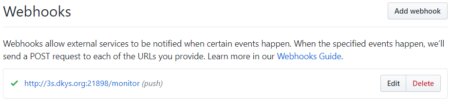

# Spring Cloud Config Server 简单使用
## 新建 Config Server
### 添加依赖
在 pom.xml添加上述依赖：
```       
        <dependency>
            <groupId>org.springframework.cloud</groupId>
            <artifactId>spring-cloud-config-server</artifactId>
        </dependency> <!-- 这里的版本是通过 spring cloud 大版本来获取的 -->
```

---
### 配置文件
配置 application.yml 文件：
```
eureka:
  client:
    service-url:
      defaultZone: http://localhost:8000/eureka/
spring:
  application:
    name: config
  cloud:
    config:
      server:
#        这里采用的是git的配置中心，也可以使用是svn的
       git:
          uri: https://github.com/WengBerg/studyspringcloud-config-repo.git
          username:
          password:
#            本地保存地址
          basedir: E:/ideaIU-2018.2.4.win/workspace/studyspringcloud/config/basedir

server:
  port: 8899
```

---

### 启动类添加注解
```
@SpringBootApplication
@EnableDiscoveryClient // 注册到eureka
@EnableConfigServer // 配置中心
public class ConfigApplication {

    public static void main(String[] args) {
        SpringApplication.run(ConfigApplication.class, args);
    }
    
}
```
## 配置 Config Client
### 添加依赖
在 pom.xml添加上述依赖：

```
        <dependency>
            <groupId>org.springframework.cloud</groupId>
            <artifactId>spring-cloud-config-client</artifactId>
        </dependency> <!-- 这里的版本是通过 spring cloud 大版本来获取的 -->
```

---
### 配置文件
配置 bootstrap.yml 文件：
> 这里采用 bootstrap 的方式是因为需要一开始就去配置中心获取配置文件
```
eureka:
  client:
    service-url:
      defaultZone: http://127.0.0.1:8000/eureka/
spring:
  application:
    name: order
  cloud:
    config:
      discovery:
        enabled: true
        service-id: config # 这个是配置中心的应用名，通过 eureka 去找
        # 在这里部分环境参数我未填写，有需要的自行填写
server:
  port: 9500
```
---

## 如何自动刷新配置
### Config Server 修改
#### 添加依赖
在 pom.xml 中添加依赖：

```
        <dependency>
            <groupId>org.springframework.cloud</groupId>
            <artifactId>spring-cloud-starter-bus-amqp</artifactId>
        </dependency> <!-- 这里注意 spring cloud 的大版本，有部分版本有bug。还有需要注意 spring cloud 的版本需要和 spring boot 的版本相对应 -->
```

---
#### 修改配置
修改 application.yml 配置：

```
eureka:
  client:
    service-url:
      defaultZone: http://localhost:8000/eureka/
spring:
  rabbitmq: # 这里使用的是 rabbitmq，用于通知更新
    host: 127.0.0.1
    port: 5672
    username: guest
    password: guest
  application:
    name: config
  cloud:
    config:
      server:
#        这里采用的是git的配置中心，也可以使用是svn的
       git:
          uri: https://github.com/WengBerg/studyspringcloud-config-repo.git
          username:
          password:
#            本地保存地址
          basedir: E:/ideaIU-2018.2.4.win/workspace/studyspringcloud/config/basedir

server:
  port: 8899
management: # 这里是将映射暴露出来。
# 使可以访问http://[配置中心域名或IP]:[端口号]/actuator/bus-refresh 刷新配置
  endpoints:
    web:
      exposure:
        include: "*"
```

---
### Config Client 修改
#### 添加依赖
在 pom.xml 中添加依赖：

```
        <dependency>
            <groupId>org.springframework.cloud</groupId>
            <artifactId>spring-cloud-starter-bus-amqp</artifactId>
        </dependency> <!-- 这里注意 spring cloud 的大版本，有部分版本有bug。还有需要注意 spring cloud 的版本需要和 spring boot 的版本相对应 -->
```
#### 添加注解
在代码中有在配置文件中获取值的地方需要添加 @RefreshScope 注解。举例：

```
@RestController
@RefreshScope
public class ConfigTestController {

    @Value("${person.name}")
    private String name;

    @GetMapping("configTest")
    public String configTest() {
        return name;
    }
}
```

---
### 更新操作
- 更新git上面的配置文件
- 访问 http://[配置中心域名或IP]:[端口号]/actuator/bus-refresh
> 如此便能刷新配置

但能不能更加人性化呢？比如 push 的就自动更新，其实是可以做到的。下面就来讲一下实现方式：
- 在 git 上设置 Webhooks


> 如何设置 Webhooks ?

> 这里我是用的 github 中的 Webhooks 

> 

> 上面就是我设置的 Webhooks，下面添加的依赖就是用来实现 Webhooks。并且在这里我一个映射软件来映射到内网。


- 在 Config Server 中的 pom.yml 中添加依赖：

```
        <dependency>
            <groupId>org.springframework.cloud</groupId>
            <artifactId>spring-cloud-config-monitor</artifactId>
        </dependency>
```