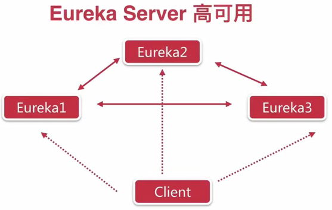

# Eureka使用入门
## Eureka Server
1. 如何配置server
    1. 在启动类添加@EnableEurekaServer注解
    2. 在application配置文件中进行一些具体的配置
    3. 配置完application可以用maven命令打包，以后直接启动就ok了
    4. application.yml
```
eureka:
      client:
        service-url:
        # 如果此处不设置默认为http://localhost:8761/eureka/
            defaultZone: http://eureka2:8761/eureka/ 
        register-with-eureka: false # 设置是否注册
    #    fetch-registry: false # 有时候需要配置此项才能设置为不注册，可能是版本的原因
      server:
        enable-self-preservation: false # 设置是否为安全模式
spring:
     application:
     name: eureka # 配置应用名称
server:
     port: 8761 # 配置服务端口
```
2. 如何做到 server 高可用
    1. server 两两相互注册
        1. 记住这里client的注册地址写上多个server（避免部分server挂掉后，重启无法注册）
        2. application.yml
```
eureka:
  client:
    service-url:
      defaultZone: http://eureka2:8762/eureka/ # 这里是配置两两注册的 server 地址
      server:
        enable-self-preservation: false # 设置是否为安全模式
spring:
     application:
        name: eureka # 配置应用名称
server:
     port: 8761 # 配置服务端口
```

## Eureka Client
1. 如何配置client
    1. 在启动类加上@EnableDiscoveryClient注解
    2. 在application配置文件中进行一些具体的配置
    3. application.yml
```
eureka:
  client:
    service-url:
      defaultZone: http://localhost:8761/eureka/,http://localhost:8762/eureka/,http://localhost:8763/eureka/
#  instance:
#    hostname: clientName # 自定义链接，不一定会用到
spring:
  application:
    name: client
```
## Eureka总结
1. Eureka用于服务发现（注册中心）
2. 服务A如何在众多的B服务中选择一个合适的？
    1. A在自己的逻辑里面去实现如何找到合适的B服务（客户端发现，这里是Eureka采用的）
    2. 注册中心去寻找一个合适的B服务给A提供服务（服务的发现，代理的方式，例如nginx）