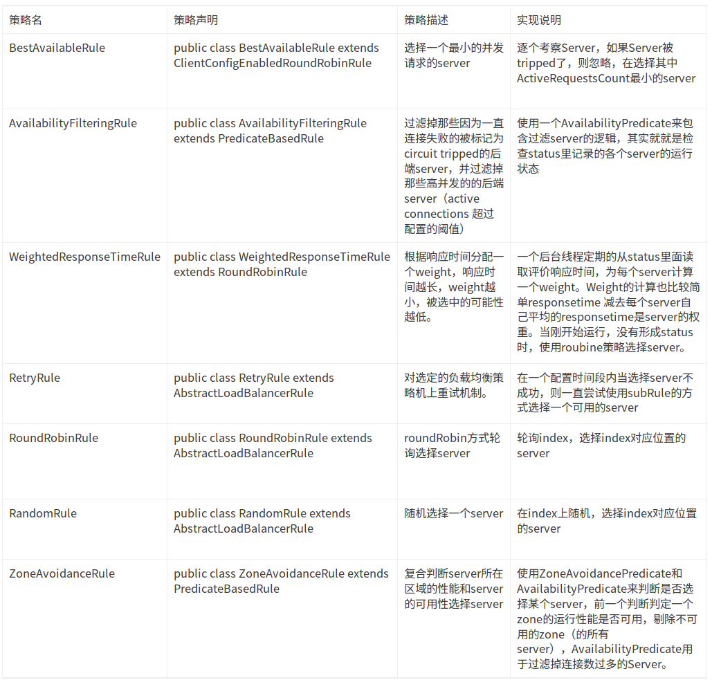

# Ribbon 详解
## Ribbon概述
Ribbon实现客户端的负载均衡。那什么是客户端负载均衡呢？这里贴一个讲解客户端负载均衡和服务端负载均衡的[链接](https://blog.csdn.net/u014401141/article/details/78676296)。

---
## Ribbon的主要组件
> 分别是IRule、IPing、ServerList 、ServerListFilter、ServerListUpdater、ILoadBalancer

---

### ILoadBalancer
> 定义软件负载平衡器操作的接口。动态更新一组服务列表及根据指定算法从现有服务器列表中选择一个服务。
- DynamicServerListLoadBalancer 
> DynamicServerListLoadBalancer组合Rule、IPing、ServerList、ServerListFilter、ServerListUpdater 实现类，实现动态更新和过滤更新服务列表
- ZoneAwareLoadBalancer 
> 这是DynamicServerListLoadBalancer的子类，主要加入zone的因素。统计每个zone的平均请求的情况，保证从所有zone选取对当前客户端服务最好的服务组列表

---

### ServerList
> 存储服务列表。分为静态和动态。如果是动态的，后台有个线程会定时刷新和过滤服务列表

---

### IRule
> 根据特定算法中从服务列表中选取一个要访问的服务

一共有7种负载均衡策略：
- 配置举例：

```
users:
  ribbon:
    NFLoadBalancerRuleClassName: com.netflix.loadbalancer.WeightedResponseTimeRule
```

---

### IPing
> 在后台运行的一个组件，用于检查服务列表是否存活

这里也有不同的策略，分别有以下策略:
- NIWSDiscoveryPing 
> 不执行真正的ping。如果Discovery Client认为是在线，则程序认为本次心跳成功，服务活着
- PingUrl 
> 此组件会使用HttpClient调用服务的一个URL，如果调用成功，则认为本次心跳成功，表示此服务活着
- NoOpPing 
> 永远返回true，即认为服务永远活着
- DummyPing 
> 默认实现，默认返回true，即认为服务永远活着
---


常用的规则有以下几种：
- ConfigurationBasedServerList 
> 从配置文件中获取所有服务列表，配置举例：
```
sample-client:
  ribbon.listOfServers: www.microsoft.com:80,www.yahoo.com:80,www.google.com:80
```
- DiscoveryEnabledNIWSServerList 
> 从Eureka Client中获取服务列表
- DomainExtractingServerList 
> 代理类，根据 ServerList 的值实现具体的逻辑
---
### ServerListFilter
> 该接口允许过滤配置或动态获取的具有所需特性的服务器列表。ServerListFilter 是 DynamicServerListLoadBalancer 用于过滤从 ServerList 实现返回的服务器的组件。

> 常用 ServerListFilter 实现有以下几种：
- ZoneAffinityServerListFilter 
> 过滤掉所有的不和客户端在相同zone的服务，如果和客户端相同的zone不存在，才不过滤不同zone有服务。
- ZonePreferenceServerListFilter 
> ZoneAffinityServerListFilter的子类。和ZoneAffinityServerListFilter相似，但是比较的zone是发布环境里面的zone。过滤掉所有和客户端环境里的配置的zone的不同的服务，如果和客户端相同的zone不存在，才不进行过滤。
- ServerListSubsetFilter 
> ZoneAffinityServerListFilter的子类。此过滤器确保客户端仅看到由ServerList实现返回的整个服务器的固定子集。 它还可以定期用新服务器替代可用性差的子集中的服务器。
---
### ServerListUpdater
> 被DynamicServerListLoadBalancer用于动态的更新服务列表。
- PollingServerListUpdater 
> 默认的实现策略。此对象会启动一个定时线程池，定时执行更新策略
- EurekaNotificationServerListUpdater 
> 当收到缓存刷新的通知，会更新服务列表。

---

### IClientConfig
> 定义各种配置信息，用来初始化ribbon客户端和负载均衡器

>常用IClientConfig实现有以下几种：
- DefaultClientConfigImpl 
> IClientConfig的默认实现，配置文件里的部分值为ribbon

---
## 简单使用

```
@RestController
@RequestMapping("order")
public class OrderController {

    @Autowired
    private LoadBalancerClient loadBalancerClient;

    @Autowired
    private RestTemplate restTemplate;

    /**
     * RestTemplate的第一种用法，写死调用链接
     * @return
     */
    @GetMapping("testOrder")
    public String testOrder() {
        RestTemplate restTemplate = new RestTemplate();
        String forObject = restTemplate.getForObject("http://localhost:9000/product/test", String.class);
        return forObject;
    }

    /**
     * 利用LoadBalancerClient获取应用的url
     * @return
     */
    @GetMapping("testOrder2")
    public String testOrder2() {
        RestTemplate restTemplate = new RestTemplate();
        ServiceInstance prodtct = loadBalancerClient.choose("product");  //product是调用服务名
        String url = String.format("http://%s:%s/product/test", prodtct.getHost(), prodtct.getPort());
        String s = restTemplate.getForObject(url, String.class);
        return s;
    }

    /**
     * 利用@LoadBalanced注解，restTemplate中直接使用应用名字。这里需要配置RestTemplateConfig
     * @return
     */
    @GetMapping("testOrder3")
    public String testOrder3() {
        String s = restTemplate.getForObject("http://product/product/test", String.class); //product是调用服务名
        return s;
    }

}
```
RestTemplateConfig 配置文件

```
@Configuration
public class RestTemplateConfig {

    @Bean
    @LoadBalanced
    public RestTemplate restTemplate() {
        return new RestTemplate();
    }
}

```

---
## 源码跟踪

```
	protected Server getServer(String serviceId) {
		return getServer(getLoadBalancer(serviceId)); // 通过 getLoadBalancer 方法拿到 server list。
		// 在这里 getLoadBalancer 其实返回的是一个 LoadBalancer 这个 LoadBalancer 中包含 ServerList、IRule、IPing 等各种所需要的信息。
	}

	protected Server getServer(ILoadBalancer loadBalancer) {
		if (loadBalancer == null) {
			return null;
		}
		// 通过 IRule 负载均衡策略
		return loadBalancer.chooseServer("default"); // TODO: better handling of key
	}
```
---
## 总结
Ribbon 客户端负载均衡实现主要是先通过算法策略拿到 server list 之后再通过 IRule 负载算法去选取一个合适的 server 提供服务。

---
[参考](https://blog.csdn.net/hry2015/article/details/78357990)

