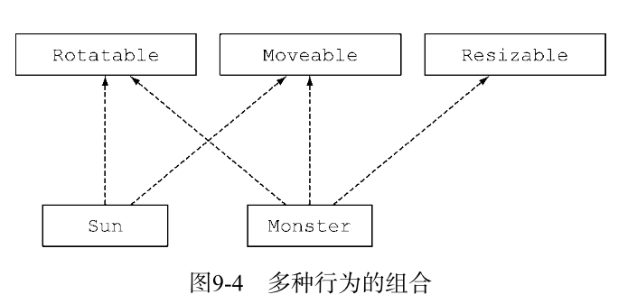
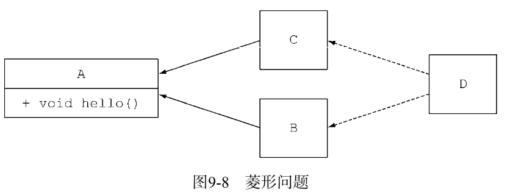

# jJava 8 接口 默认方法

示例代码：

```java
        List<String> stringList = new ArrayList<>();
        
        stringList.stream().forEach(s -> System.out.println(s));
        
        stringList.parallelStream().forEach(s -> System.out.println(s));
```

在这里有一个明显的问题就是：在Java 8之前，List<T>并没有**stream**或**parallelStream**方法，它实现的Collection<T>接口也没有，这样会导致有很多的替代集合框架都用Collection API实现了接口。但给接口加入一个新方法，意味着所有的实体类都必须为其提供一个实现。语言设计者是没法控制Collections所有现有的实现的，现在需要做到你如何改变已发布的接口而不破坏已有的实现：

1. 最简单的解决方案就是让Java 8的设计者把stream方法加入Collection接口，并加入ArrayList类的实现。但是上面也说到，语言设计者是没法控制Collections所有现有的实现的，所以这种方案只能用于自己的接口。
2. 第二种方案就是缺失的方法主体随接口提供了（因此就有了**默认实现**），而不是由实现类提供。

**注意：**向接口添加新方法是*二进制兼容*的，这意味着如果不重新编译实现该接口的类，即使不实现新的方法， 现有类的实现<u>依旧可以运行</u>。

> 何为*二进制兼容*？
>
>二进制级的兼容性表示现有的二进制执行文件能无缝持续链接（包括验证、准备和解析）和运行。>比如，为接口添加一个方法就是二进制级的兼容，这种方式下，如果新添加的方法不 被调用，接口已经实现的方法可以继续运行，不会出现错误。

这里再讲另外两种兼容性分别是**源代码和函数行为**级别兼容性。

- 源代码兼容

简单地说，源代码级的兼容性表示引入变化之后，现有的程序依然能成功编译通过。比如，向接口添加新的方法就不是源码级的兼容，因为遗留代码并没有实现新引入的方法，所以它们无法顺利通过编译。

- 函数行为级别兼容性

表示变更发生之后，程序接受同样的输入能得到同样的结果。


## **默认实现**

例如，在Java 8里，你现在可以直接对List调用sort方法。它是用Java 8 List接口中如下所示的默认方法实现的，它会调用Collections.sort静态方法：

```java
default void sort(Comparator<? super E> c) {
    Collections.sort(this, c);
}
```

在Java 8中List的任何实体类都不需要显式实现sort，而在以前的Java版本中必须提供sort的实现，否则这些实体类在重新编译时都会失败。**默认方法是一种以源码兼容方式向接口内添加实现的方法**。

**补充**：同时定义接口以及工具辅助类（companion class）是Java语言常用的一种模式，工具类定义了与接口实例协作的很多静态方法。比如，Collections就是处理Collection对象的辅助类。由于<u>静态方法可以存在于接口内部</u>，你代码中的这些辅助类就没有了存在的必要，你可以把这些静态方法转移到接口内部。

- 抽象类和接口的区别

1. 一个类只能继承一个抽象类，但是一个类可以实现多个接口。
2. 一个抽象类可以通过实例变量（字段）保存一个通用状态，而<u>接口是不能有实例变量</u>的。

## 默认方法使用场景

1. 默认方用于兼容的方式演进库函数，就像上面所提到的一样。
2. 可选方法

比如在某些时候，类实现了接口，不过却刻意地将一些方法的实现留白。就例如Iterator接口定义了hasNext、next，还定义了remove方法。Java 8 之前，由于用户通常不会使用该方法，remove方法常被忽略。因此，实现Interator接口的类通常会为remove方法放置一个空的实现，这些都是些毫无用处的模板代码。

采用默认方法之后，你可以为这种类型的方法提供一个默认的实现，这样实体类就无需在自己的实现中显式地提供一个空方法。

示例代码：

```java
interface Iterator<T> {
	boolean hasNext(); 
    T next();
	default void remove() { 
    throw new UnsupportedOperationException(); 
	}
}
```

3. 行为的多继承

- 利用接口多继承的特性可以做到<u>利用正交方法的精简接口</u>
- 组合接口

## 默认方法解决冲突

如果一个类使用相同的函数签名从多个地方（比如另一个类或接口）继承了方法，可以使用以下方法来解决冲突。
1. 类中的方法优先级最高。类或父类中声明的方法的优先级高于任何声明为默认方法的优先级。
2. 如果无法依据第一条进行判断，那么子接口的优先级更高：函数签名相同时，优先选择拥有**最具体实现的默认方法**的接口，即如果B继承了A，那么B就比A更加具体。
3. 最后，如果还是无法判断，继承了多个接口的类必须通过显式覆盖和调用期望的方法，显式地选择使用哪一个默认方法的实现。

### 菱形继承问题



1. 若C、B类都使用A接口的默认方法，那么D中hello()方法会打印A接口中的hello()方法内容。
2. 若B或C类实现了hello()方法，那么D中会根据冲突解决方法中的（2）条去打印最具实现的hello()方法。
3. 如果C、D类都实现了hello()方法，那么在D类中只能显示的指出使用哪个类的方法了。