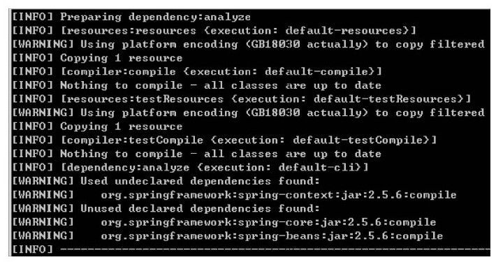
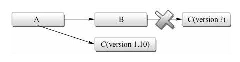
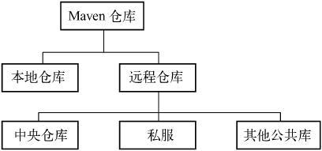
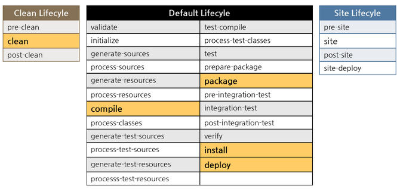
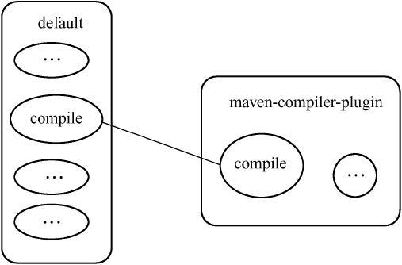
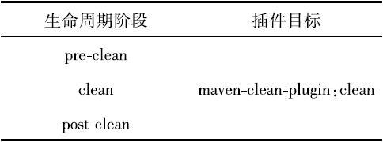

# maven基础

这里不记录如何配置下载，如何配置path之类（太简单了）。

## 配置 setting.xml 

> 这里主要讲几个常用的关键字：


### localRepository

设置本地maven仓库路径

### proxies

可以设置代理，可设置多个，类似于网络翻墙操作

#### proxy 

```xml
  <!-- proxies
   | This is a list of proxies which can be used on this machine to connect to the network.
   | Unless otherwise specified (by system property or command-line switch), the first proxy
   | specification in this list marked as active will be used.
   |-->
   <!-- -->
  <proxies>
    <!-- proxy
     | Specification for one proxy, to be used in connecting to the network.
     |
    
    -->
	 <!--<proxy>
      <id>optional</id>
      <active>true</active>
      <protocol>http</protocol>
      <host>172.17.18.84</host>
      <port>8080</port>
      <nonProxyHosts>local.net|some.host.com</nonProxyHosts>
    </proxy>-->
	<!-- 
	<proxy>
      <id>travelsky</id>
      <active>true</active>
      <protocol>http</protocol>
      <username/>
      <password/>
      <host>172.17.18.80</host>
      <port>8080</port>
      <nonProxyHosts>local.net|10.*.*.*|172.17.*.*|172.18.*.*|10.8.*|172.*|172.27.*.*|*.travelsky.*</nonProxyHosts>
    </proxy>
	-->
  </proxies>
```


### mirrors

设置镜像，可设置多个，可在该地址上下载依赖，类似于在pom中设置repository

#### mirror

```xml
  <!-- mirrors
   | This is a list of mirrors to be used in downloading artifacts from remote repositories.
   | 
   | It works like this: a POM may declare a repository to use in resolving certain artifacts.
   | However, this repository may have problems with heavy traffic at times, so people have mirrored
   | it to several places.
   |
   | That repository definition will have a unique id, so we can create a mirror reference for that
   | repository, to be used as an alternate download site. The mirror site will be the preferred 
   | server for that repository.
   |-->
  <mirrors>
    <!-- mirror
     | Specifies a repository mirror site to use instead of a given repository. The repository that
     | this mirror serves has an ID that matches the mirrorOf element of this mirror. IDs are used
     | for inheritance and direct lookup purposes, and must be unique across the set of mirrors.
     |
    <mirror>
      <id>mirrorId</id>
      <mirrorOf>repositoryId</mirrorOf>
      <name>Human Readable Name for this Mirror.</name>
      <url>http://my.repository.com/repo/path</url>
    </mirror>
     -->
  </mirrors>
```

一个镜像可以对应多个仓库，具体在mirrorOf上配置。**注意**：镜像仓库会完全屏蔽了被镜像仓库。

### servers

一般用于配置私服的验证授权信息，可以配置多个 server

#### server

```xml
  <!-- servers
   | This is a list of authentication profiles, keyed by the server-id used within the system.
   | Authentication profiles can be used whenever maven must make a connection to a remote server.
   |-->
  <servers>
    <!-- server
     | Specifies the authentication information to use when connecting to a particular server, identified by
     | a unique name within the system (referred to by the 'id' attribute below).
     | 
     | NOTE: You should either specify username/password OR privateKey/passphrase, since these pairings are 
     |       used together.
     |
    <server>
      <id>deploymentRepo</id>
      <username>repouser</username>
      <password>repopwd</password>
    </server>
    -->
    
    <!-- Another sample, using keys to authenticate.
    <server>
      <id>siteServer</id>
      <privateKey>/path/to/private/key</privateKey>
      <passphrase>optional; leave empty if not used.</passphrase>
    </server>
    -->
  </servers>
```

一般用于配置需要验证的mirror和repository，可配置多个server。

## 配置pom.xml

> 查看当前项目的依赖树：mvn dependency:tree > d.txt
> 
> 查看当前项目的已解析依赖：mvn dependency:list
> 
> 帮助分析当前项目的依赖:mvn dependency:analyze 
> 
> 	
> 上图中 **Used undeclared dependencies**，意指项目中使用到的，但是没有显式声明的依赖。这种依赖是通过直接依赖传递进来的，当升级直接依赖的时候，相关传递性依赖的版本也可能发生变化，这种变化不易察觉，但是有可能导致当前项目出错。例如由于接口的改变，当前项目中的相关代码无法编译。
> 
> **Unused declared dependencies**，意指项目中未使用的，但显式声明的依赖。对于这样一类依赖，我们不应该简单地直接删除其声明，而是应该仔细分析。由于dependency：analyze只会分析编译主代码和测试代码需要用到的依赖，一些执行测试和运行时需要的依赖它就发现不了。

### groupId

组类型，举例：com.berg

### artfactId 

功能命名

### version

版本号

> groupId、artifactId和version，这三个元素定义了一个项目基本的坐标，在Maven的世界，任何的jar、pom或者war都是以基于这些基本的坐标进行区分的。

### packaging
打包方式 默认为 jar。可选：
- war
- ejb
- ear
- rar
- par
- pom
- maven-plugin

### dependencyManagement

> 主要用来做以来管理

1. 最好只出现在父pom
2. 统一版本号
3. 声明 (子POM里需要使用再来引用)

### dependency

```xml
＜project＞
……
＜dependencies＞
＜dependency＞
＜groupId＞……＜/groupId＞
＜artifactId＞……＜/artifactId＞
＜version＞……＜/version＞
＜type＞……＜/type＞
＜scope＞……＜/scope＞
＜optional＞……＜/optional＞
＜exclusions＞
＜exclusion＞
……
＜/exclusion＞
……
＜/exclusions＞
＜/dependency＞
……
＜/dependencies＞
……
＜/project＞
```

这里主要讲一下几个参数：

- type：依赖的类型，默认为jar，对应于项目坐标定义的packaging。

- scope：依赖的范围。
	
	1. compile：编译依赖范围。默认依赖范围。使用此依赖范围的Maven依赖，对于编译、测试、运行三种classpath都有效。典型的例子是spring-core，在编译、测试和运行的时候都需要使用该依赖。
	
	2. test：测试依赖范围。使用此依赖范围的Maven依赖，只对于测试classpath有效，在编译主代码或者运行项目的使用时将无法使用此类依赖。典型的例子是JUnit，它只有在编译测试代码及运行测试的时候才需要。
	
	3. provided：已提供依赖范围。使用此依赖范围的Maven依赖，对于编译和测试classpath有效，但在运行时无效。典型的例子是servlet-api，编译和测试项目的时候需要该依赖，但在运行项目的时候，由于容器已经提供，就不需要Maven重复地引入一遍。
	
	4. runtime：运行时依赖范围。使用此依赖范围的Maven依赖，对于测试和运行classpath有效，但在编译主代码时无效。典型的例子是JDBC驱动实现，项目主代码的编译只需要JDK提供的JDBC接口，只有在执行测试或者运行项目的时候才需要实现上述接口的具体JDBC驱动。
	
	5. system：系统依赖范围。该依赖与三种classpath的关系，和provided依赖范围完全一致。
	
	   - ```xml
	     ＜dependency＞
	     ＜groupId＞javax.sql＜/groupId＞
	     ＜artifactId＞jdbc-stdext＜/artifactId＞
	     ＜version＞2.0＜/version＞
	     ＜scope＞system＜/scope＞
	     ＜systemPath＞${java.home}/lib/rt.jar＜/systemPath＞
	     ＜/dependency＞
	     ```
	
	     system范围的依赖时必须通过systemPath元素显式地指定依赖文件的路径。
	
	6. import（Maven 2.0.9及以上）：导入依赖范围。**只在dependencyManagement元素下才有效果**，使用该范围的依赖通常指向一个POM，作用是将目标POM中的dependencyManagement配置导入并合并到当前POM的dependencyManagement元素中。示例：

	   - ```xml
	     ＜dependencyManagement＞
	     
	     ＜dependencies＞
	     
	     ＜dependency＞
	     
	     ＜groupId＞com.juvenxu.mvnbook.account＜/groupId＞
	     
	     ＜artifactId＞account-parent＜/artifactId＞
	     
	     ＜version＞1.0-SNAPSHOT＜/version＞
	     
	     ＜type＞pom＜/type＞
	     
	     ＜scope＞import＜/scope＞
	     
	     ＜/dependency＞
	     
	     ＜/dependencies＞
	     
	     ＜/dependencyManagement＞
	     ```
	
	     上面的代码会将 groupId 为 com.juvenxu.mvnbook.account，artifactId 为 account-parent的POM中的dependencyManagement配置导入并合并到当前POM的dependencyManagement元素中。
	   
	- scope 依赖传递：	

	|          | compile    | provided | runtime  | test |
	| -------- | ---------- | -------- | -------- | ---- |
	| compile  | compile(*) | -        | runtime  | -    |
	| provided | provided   | -        | provided | -    |
	| runtime  | runtime    | -        | runtime  | -    |
	| test     | test       | -        | test     | -    |
	
	
	
- optional：标记依赖是否可选。可选依赖不会传递，关于可选依赖需要说明的一点是，在理想的情况下，是不应该使用可选依赖的。使用可选依赖的原因是某一个项目实现了多个特性，在面向对象设计中，有个单一职责性原则，意指一个类应该只有一项职责，而不是糅合太多的功能。这个原则在规划Maven项目的时候也同样适用。

- exclusions：用来排除传递性依赖。

[依赖传递官方文档链接](https://maven.apache.org/guides/introduction/introduction-to-dependency-mechanism.html#Dependency_Scope)

### repository

- 仓库分类：



- 远程仓库配置详情：

```xml
＜repositories＞

＜repository＞

＜id＞jboss＜/id＞

＜name＞JBoss Repository＜/name＞

＜url＞http://repository.jboss.com/maven2/＜/url＞

＜releases＞

＜enabled＞true＜/enabled＞

＜/releases＞

＜snapshots＞

＜enabled＞false＜/enabled＞

＜/snapshots＞

＜layout＞default＜/layout＞

＜/repository＞

＜/repositories＞
```

> 该例配置中的releases和snapshots元素比较重要，它们用来控制Maven对于发布版构件和快照版构件的下载。

对于releases和snapshots来说，除了enabled，它们还包含另外两个子元素updatePolicy和checksumPolicy：

```xml
＜snapshots＞

＜enabled＞true＜/enabled＞

＜updatePolicy＞daily＜/updatePolicy＞

＜checksumPolicy＞ignore＜/checksumPolicy＞

＜/snapshots＞
```

> 元素updatePolicy用来配置Maven从远程仓库检查更新的频率，默认的值是daily，表示Maven每天检查一次。其他可用的值包括：never—从不检查更新；always—每次构建都检查更新；interval:X—每隔X分钟检查一次更新（X为任意整数）。
>
> 元素checksumPolicy用来配置Maven检查检验和文件的策略。当构件被部署到Maven仓库中时，会同时部署对应的校验和文件。在下载构件的时候，Maven会验证校验和文件，如果校验和验证失败，若hecksumPolicy的值为默认的warn时，Maven会在执行构建时输出警告信息，其他可用的值包括：fail—Maven遇到校验和错误就让构建失败；ig-nore—使Maven完全忽略校验和错误。

- 远程仓库的认证：

使用settings.xml文件中servers元素及其server子元素配置仓库认证信息。

### distributionManagement

```xml
＜distributionManagement＞

＜repository＞

＜id＞proj-releases＜/id＞

＜name＞Proj Release Repository＜/name＞

＜url＞http://192.168.1.100/content/repositories/proj-releases＜/url＞

＜/repository＞

＜snapshotRepository＞

＜id＞proj-snapshots＜/id＞

＜name＞Proj Snapshot Repository＜/name＞

＜url＞http://192.168.1.100/content/repositories/proj-snapshots＜/url＞

＜/snapshotRepository＞

＜/distributionManagement＞
```

distributionManagement包含repository和snapshotRepository子元素，前者表示发布版本构件的仓库，后者表示快照版本的仓库。

远程仓库部署构件的时候，往往需要认证。需要在settings.xml中创建一个server元素，其id与仓库的id匹配，并配置正确的认证信息。不论从远程仓库下载构件，还是部署构件至远程仓库，当需要认证的时候，配置的方式是一样的。

发布命令：**mvn clean deploy**

## 生命周期

> 在有关Maven的日常使用中，命令行的输入往往就对应了生命周期，如mvn package就表示执行默认生命周期阶段package。Maven的生命周期是抽象的，其实际行为都由插件来完成，如package阶段的任务可能就会由maven-jar-plugin完成。



> Maven拥有三套相互独立的生命周期，它们分别为clean、default和site。clean生命周期的目的是清理项目，default生命周期的目的是构建项目，而site生命周期的目的是建立项目站点。
>
> 每个生命周期包含一些阶段（phase），这些阶段是有顺序的，并且后面的阶段依赖于前面的阶段。
>
> 当用户调用pre-clean的时候，只有pre-clean阶段得以执行；当用户调用clean的时候，pre-clean和clean阶段会得以顺序执行；当用户调用post-clean的时候，pre-clean、clean和post-clean会得以顺序执行。
>
> 较之于生命周期阶段的前后依赖关系，三套生命周期本身是相互独立的，用户可以仅仅调用clean生命周期的某个阶段，或者仅仅调用default生命周期的某个阶段，而不会对其他生命周期产生任何影响。
>
> 例如，当用户调用clean生命周期的clean阶段的时候，不会触发default生命周期的任何阶段。

- clean生命周期的目的是清理项目
- default生命周期定义了真正构建时所需要执行的所有步骤
- site生命周期的目的是建立和发布项目站点

### 插件

#### 插件目标

插件目标概念：

> 对于插件本身，为了能够复用代码，它往往能够完成多个任务。例如maven-dependency-plugin，它能够基于项目依赖做很多事情。它能够分析项目依赖，帮助找出潜在的无用依赖；它能够列出项目的依赖树，帮助分析依赖来源；它能够列出项目所有已解析的依赖，等等。为每个这样的功能编写一个独立的插件显然是不可取的，因为这些任务背后有很多可以复用的代码，因此，这些功能聚集在一个插件里，**每个功能就是一个插件目标**。

插件目标写法：

>maven-dependency-plugin有十多个目标，每个目标对应了一个功能，上述提到的几个功能分别对应的插件目标为dependency：analyze、dependency：tree和dependency：list。这是一种通用的写法，**冒号前面是插件前缀，冒号后面是该插件的目标**。

#### 插件绑定

> Maven的生命周期与插件相互绑定，用以完成实际的构建任务。

示例：项目编译这一任务，它对应了default生命周期的compile这一阶段，而maven-compiler-plugin这一插件的compile目标能够完成该任务。因此，将它们绑定，就能实现项目编译的目的。图例：

其实是生命周期和插件的goal（具体对应的功能）相互绑定。

图例：

