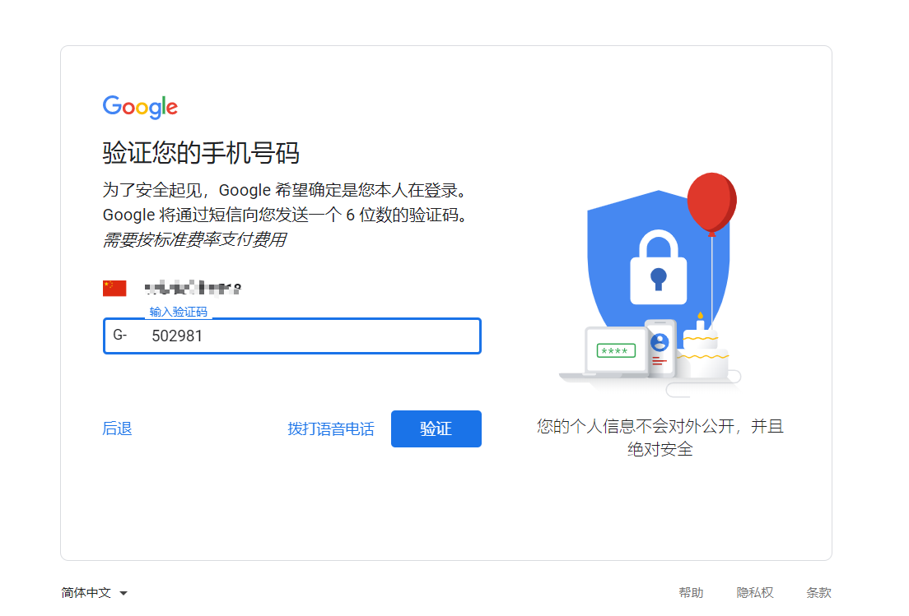
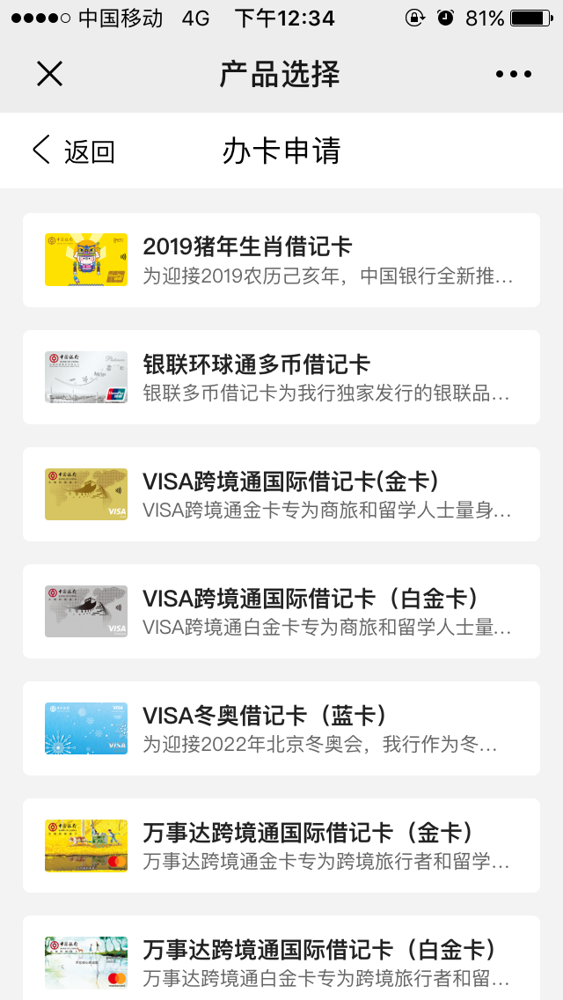
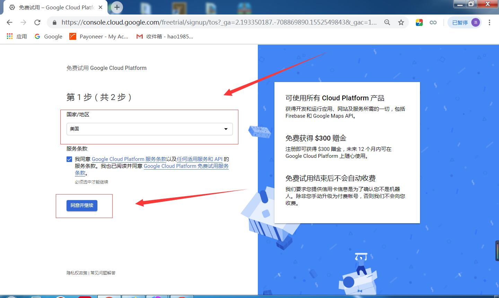
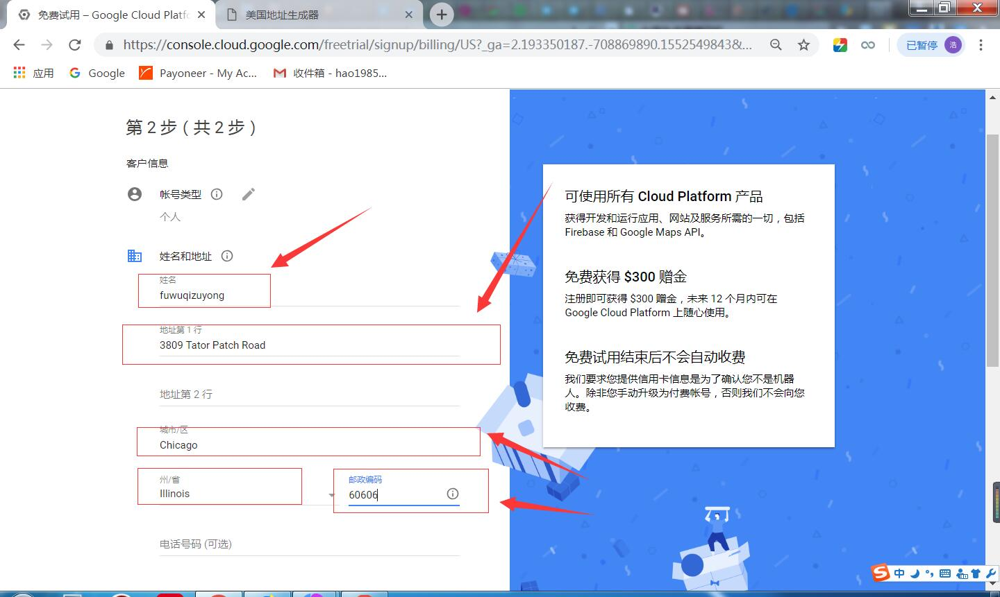
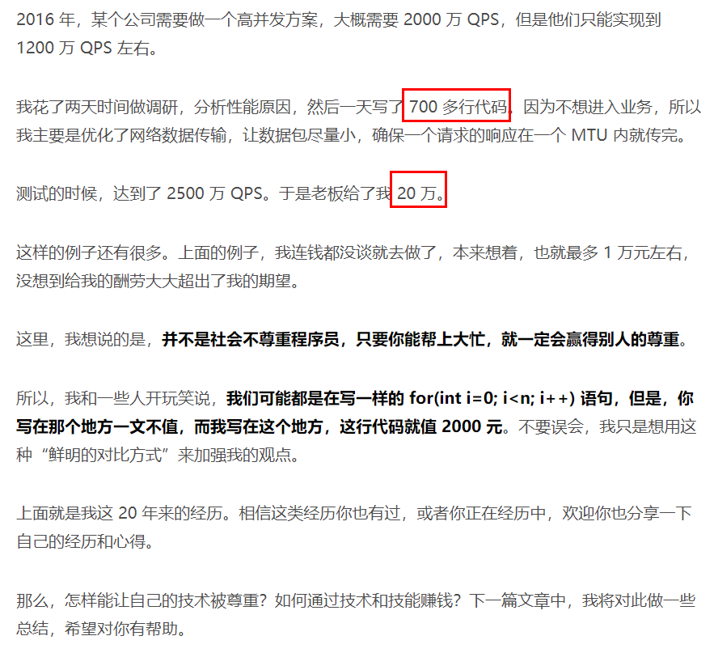
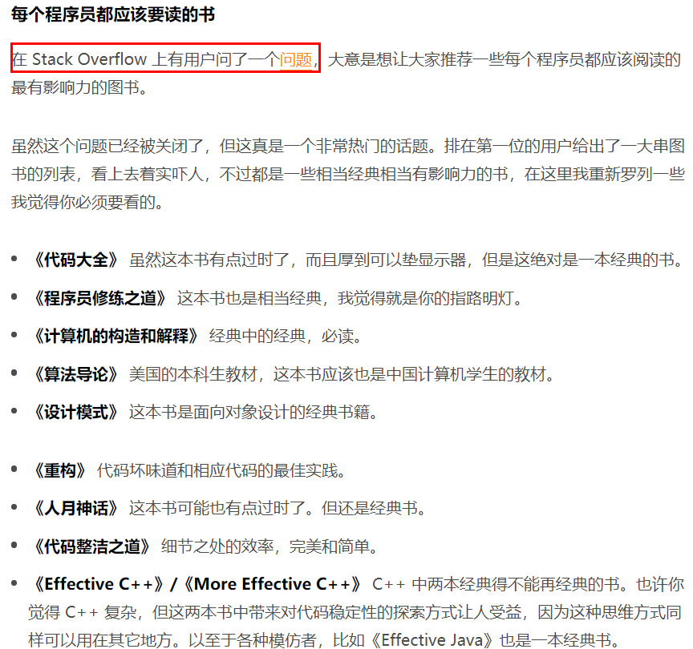

# 分享内容

## 实用VPS分享
### 如何免费获取一年的谷歌云?

#### 首先注册一个谷歌账号
由于一些原因第一步需要**科学上网**,而且最好是通过**香港的节点**.

给大家准备好的免费科学上网工具，[百度云地址](https://pan.baidu.com/s/18xbii0zGiyG1S3ToZVwD2Q) 提取码: 1111

目前只有香港的节点最容易注册成功,其他的地点都很可能失败.(因为注册谷歌账号是需要手机接收验证码,如果是美国的节点很可能收不到验证码,即使你填的地区是中国,也可能收不到)

#### 需要visa或万事达的借记卡或信用卡
如果不愿意办理信用卡,目前最好的解决办法就是有visa的借记卡.
目前最方便的方式就是办理**中国银行的长城跨境通借记卡**了,
可以直接通过微信公众号办理很方便的-**个金微咨询**这个公众号就可以办理了.

具体的细节在这里就不太描述了,具体细节操作[链接](https://poplite.xyz/post/2018/03/05/boc-debit-card-guide-for-online-payment.html)在此.

#### 最后一步登陆谷歌云获取实例

这里需要注意地区的选择

在这里最好选择美国，因为选择其他的国家的话你需要其他国家的**真实地址**和选择的国家支持不支持个人用户免费领取，还有**支持不支持信用卡验证**。

后面就是地址填写了

这里给大家一个真实地址的生产器，[链接](http://haoweichi.com/More/meiguo_zhenshi_dizhi)

最后就是绑卡拿一年试用了

注意：“**信用卡或借记卡账单邮寄地址与上述地址相同**”这里我们将前面的对勾取消掉

#### 最后

一般情况下通过这上面的一些操作就可以拿到免费一年的谷歌云实例了。

若运气不好的，拿不到也没法。因为最近谷歌加强了审核机制，据传是因为国内申请免费实例的人太多，导致 Google Cloud 的 Compute Engine（计算机引擎）VM实例运行速度缓慢，于是谷歌不再支持中国大陆用户享受这项便利。

- **备用方案**

可以去申请一个**AWS的lightsail** 免费试用一个月，但是后续费用也比较低也就3美元一个月，实例的话可以选韩国的节点，这样就和在国内买的阿里云的延迟差不多，并且可以拥有给好的带宽，而且做网站也不用很麻烦的去备案，80端口也是直接开放的。

### 如何使用谷歌云观看Netflix上的视频?

> 这里主要介绍给喜欢看美剧同事

由于Netflix会对代理的ip和地区ip进行限制，导致很多科学上网的代理是不能用来观看Netflix上的视频的，但是Google云和AWS上的lightsail一部分ip是可以看的，但是这种ip很难找到。目前解决办法是购买一个可以解锁的DNS服务。最后分享一个可以免费获取Netflix账号的[网站](https://www.uud.me/)

## 分享一个技术大佬

### 陈皓

> 这是在极客时间里面接触到的一个，我认为比较好的一个技术大佬。

他有一个技术专栏叫《程序员练级攻略（2018）版》，这里面分享不是什么最新的技术，是分享的一些学习路径和一些基础学习资料。

这里面有几篇文章我觉得挺不错的，在这里分享给大家。

一篇是** 《程序员如何用技术变现》 **中的这里 ->

**画重点了!**

还有一篇就是** 《每个程序员都该知道的知识》 ** ->

这里是上面圈红的[链接](https://stackoverflow.com/questions/1711/what-is-the-single-most-influential-book-every-programmer-should-read)
这边文章中还有一个链接-[**每个搞计算机专业的人应有的知识**](http://matt.might.net/articles/what-cs-majors-should-know/)

最后付上该专栏的[百度云地址](https://pan.baidu.com/s/1XTomq3s4WZpb8o1mN0lIpg)提取码: 1111

## 实用软件分享

### 天若ocr

这是一个非常方便的ocr识图软件。

[地址](https://tianruoocr.cn/)

### Snipaste

这是一个截图贴图软件，特别是前端在开发的时候应该比较有用。
这个是uwp软件，可以直接在win10的应用商店里面下载。

### xodo

这是一个pdf阅读器，最近才发现的，可以配合增量的云盘（坚果云或者天意云盘中的同步盘功能）来做pdf电子书的笔记，可以实现移动端和电脑端的同步。
这个也是一个uwp软件，也可以在win10的应用商店里面下载。

## 实用网站分享
### 云盘精灵

这是一个百度网盘的搜索软件

[地址](https://www.yunpanjingling.com/)
还有一个和这个网站类似，[我爱搜盘](https://www.52sopan.com/index.html)

顺便在推荐一个百度网盘的下载神器，这个应该大多数同时都知道。[pandownload](https://pandownload.com/)

### amazing-apps

这个里会推荐很多良心的windows软件，大家可以去发现一下。

[地址](https://amazing-apps.gitbook.io/windows-apps-that-amaze-us/zh-cn/summary)