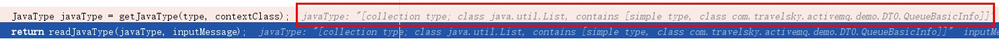

#Spting MVC 前端 json 传 List

- 今天遇到一个前端传递list的问题，一般传递fom表单一类的springMVC都会自动封装，但是list却不行。

实体类代码如下：

```java
public class QueueBasicInfo {
    private String destinationName;

    private String brokerName;

    public String getDestinationName() {
        return destinationName;
    }

    public void setDestinationName(String destinationName) {
        this.destinationName = destinationName;
    }

    public String getBrokerName() {
        return brokerName;
    }

    public void setBrokerName(String brokerName) {
        this.brokerName = brokerName;
    }
}
```
controller代码如下：

```java
    @PostMapping("getMonitorDestinationData")
    public Object getMonitorDestinationData( @RequestBody List<QueueBasicInfo> queueBasicInfoList) {
        
    }
```

前端json代码如下：

```javascript
[{"destinationName":"demoQueueDestination2","brokerName":"localhost"},{"destinationName":"demoQueueDestination3","brokerName":"localhost"},{"destinationName":"demoQueueDestination1","brokerName":"localhost"}]
```

这样就可以讲List传到后端了,注意前端参数名也为**queueBasicInfoList**，在这里 mvc 会将json对象依次去匹配QueueBasicInfo对象，然后在返回List<QueueBasicInfo> ,类似这样-> 

