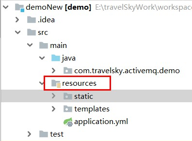

## spring boot 静态资源文件路径
- 默认为下面的路径：
```xml
spring.resources.static-locations=classpath:/META-INF/resources/,classpath:/resources/,classpath:/static/,classpath:/public/
```
> 这些路径都是在




我在这里踩坑了，我一直以为这些路径是相对在src下，导致一直都访问不出来。

- 如果要自定义的去添加路径需要：
    - 配置类
```java
    @Configuration
    public class WebMvcConfig extends WebMvcConfigurationSupport {
        @Override
        protected void addResourceHandlers(ResourceHandlerRegistry registry) {
            //将所有/test/** 下的文件访问都映射到/myTest/** 请求路径下访问
            registry.addResourceHandler("/test").addResourceLocations("/location" +
                    "/test/**");
        }
    }   
```
- application.properties配置文件
  
> spring.resources.static-locations =  classpath:/META-INF/resources/,classpath:/resources/ #在这里配置路径，类似这样
## spring boot 静态资源url访问路径
一般通过 yml 或者 properties 文件直接配置：
- yml 方式：

```yaml
spring:
  mvc:
    static-path-pattern: /static/** # url 访问的路径
```
> properties 方式类似


