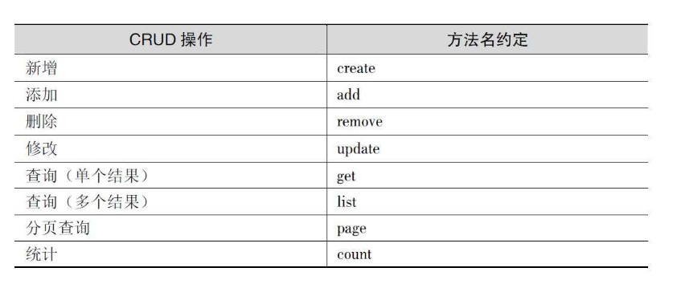

# 《代码精进之路：从码农到工匠》读书笔记

## 第一部分 技艺

### 第一章 命名

#### 有意义的命名

##### 变量名

变量名应该是名词，能够正确地描述业务，有表达力。如果一个变量名需要注释来补充说明，那么很可能说明命名就有问题。

##### 函数名

- 函数命名要具体，空泛的命名没有意义。
- 函数的命名要体现做什么，而不是怎么做。

##### 类名

- 实体类承载了核心业务数据和核心业务逻辑，其命名要充分体现业务语义，并在团队内达成共识，如Customer、Bank和Employee等。
- 辅助类是辅佐实体类一起完成业务逻辑的，其命名要能够通过后缀来体现功能。例如，用来为Customer做控制路由的控制类CustomerController、提供Customer服务的服务类CustomerService、获取数据存储的仓储类CustomerRepository。
- 对于辅助类，尽量不要用Helper、Util之类的后缀，因为其含义太过笼统，容易破坏SRP（单一职责原则）。

##### 包名

- 包的命名要适中，不能太抽象，也不能太具体。

##### 模块名

- 在Maven中，模块名就是一个坐标: <groupId, artifactId>。一方面，其名称保证了模块在Maven仓库中的唯一性；另一方面，名称要反映模块在系统中的职责。

#### 保持命名的一致性

> 每个概念对应一个词，并且一以贯之。例如，fetch、retrieve、get、find和query都可以表示查询的意思，如果不加约定地给多个类中的同种查询方法命名，你怎么记得是哪个类中的哪个方法呢？

- 方法名约定（参考）
  - 

- 遵守对仗词的命名规则有助于保持一致性
  - add/remove
  - increment/decrement
  - open/close
  - begin/end
  - insert/delete
  - show/hide
  - create/destroy
  - lock/unlock
  - source/target
  - first/last
  - min/max
  - start/stop
  - get/set
  - next/previous
  - up/down
  - old/new

##### 后置限定词

> 很多程序中会有表示计算结果的变量，例如总额、平均值、最大值等。如果你要用类似Total、Sum、Average、Max、Min这样的限定词来修改某个命名，那么记住把限定词加到名字的最后。

示例：

- revenueTotal（总收入）、expenseTotal（总支出）

### 自明的代码

> 自明性，就是在不借助其他辅助手段的情况下，代码本身就能向读者清晰地传达自身的含义。

